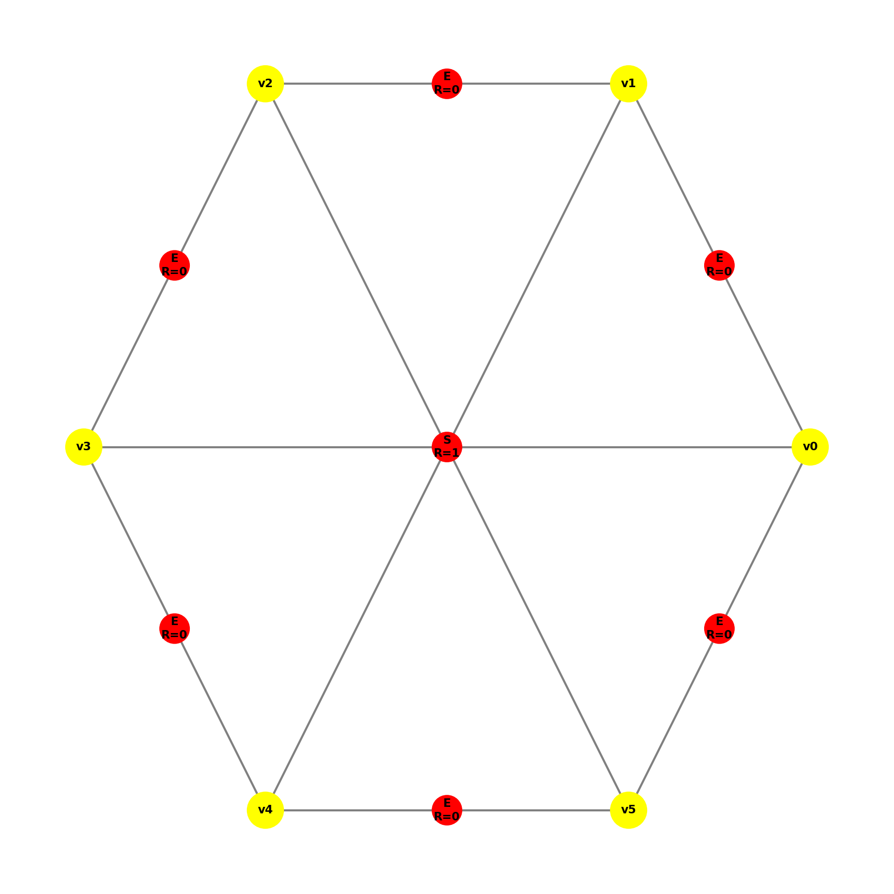
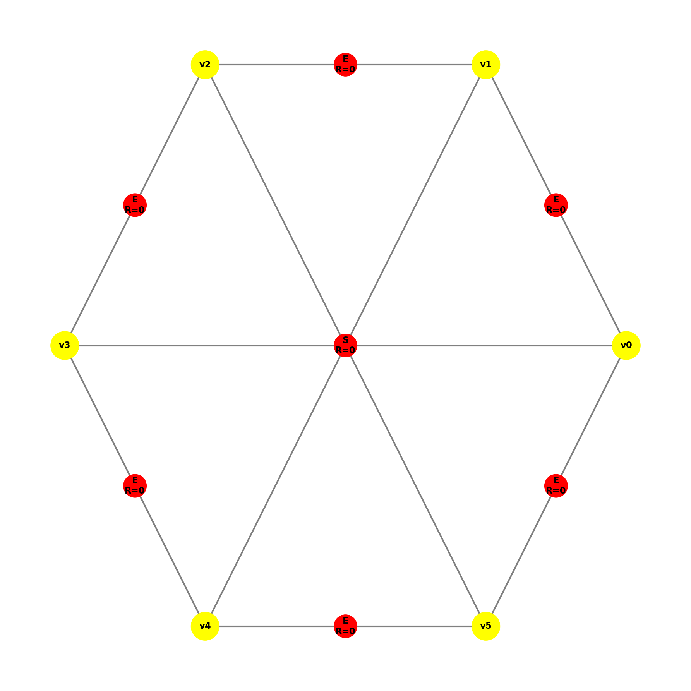
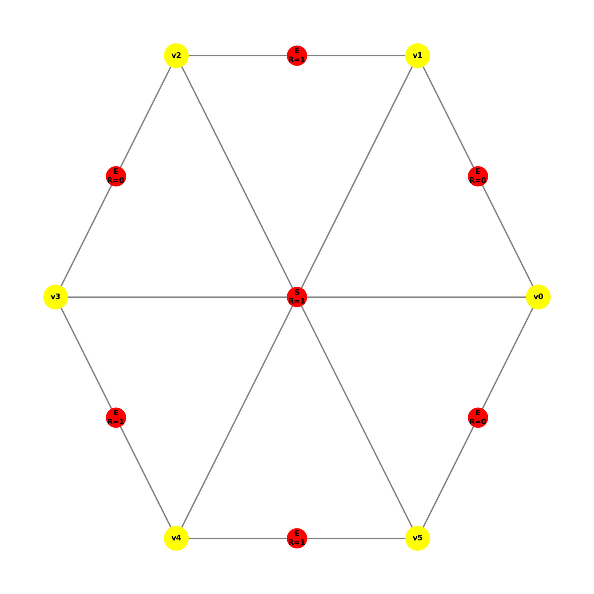
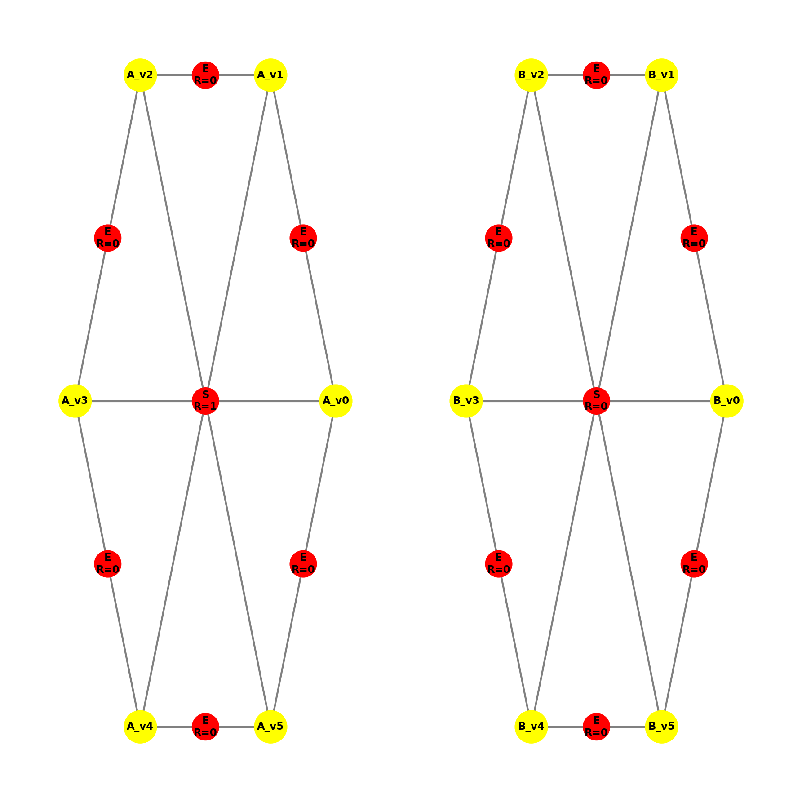
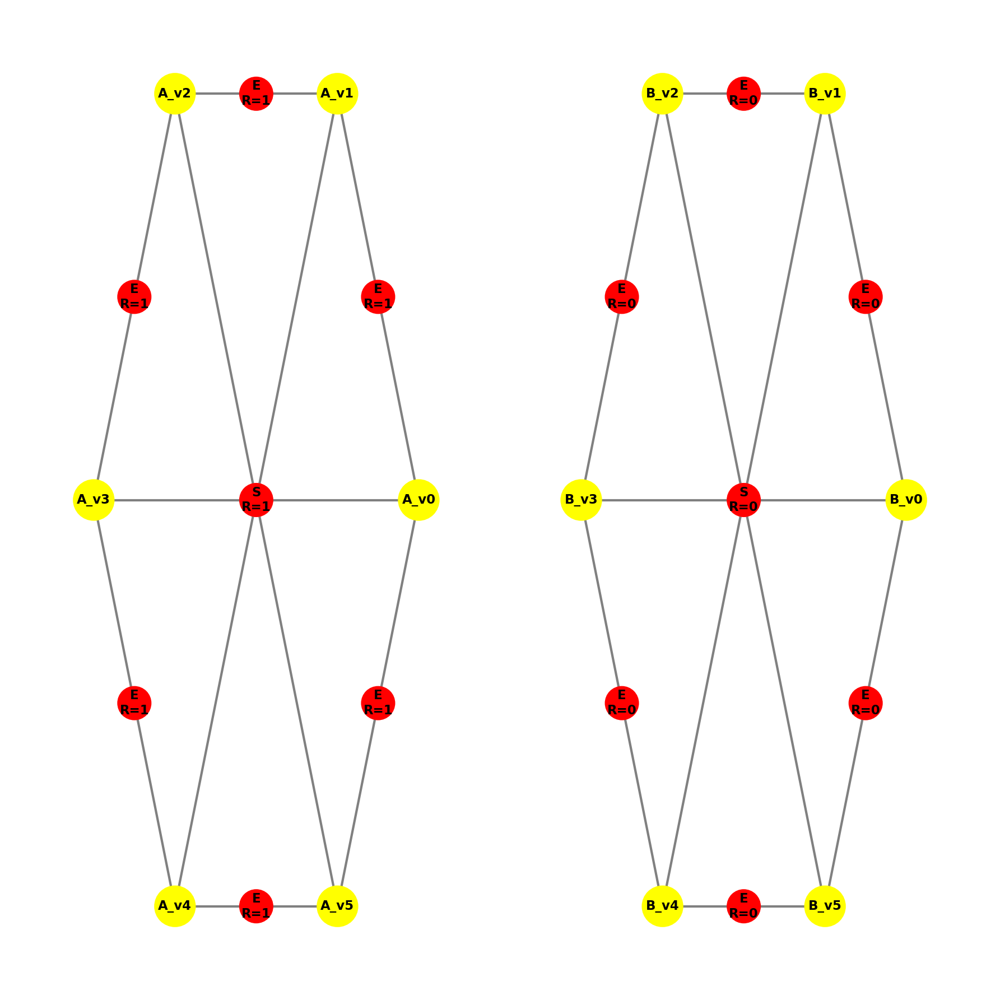
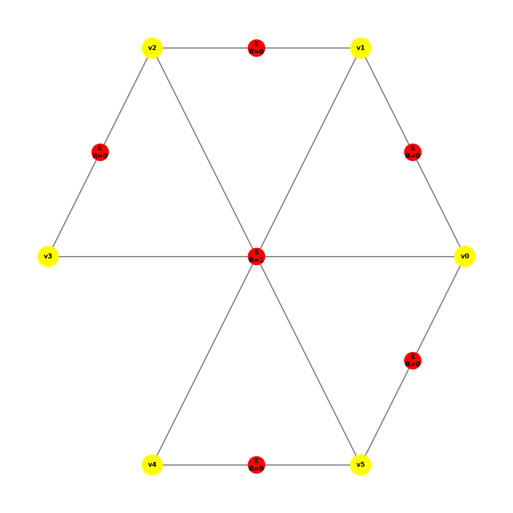
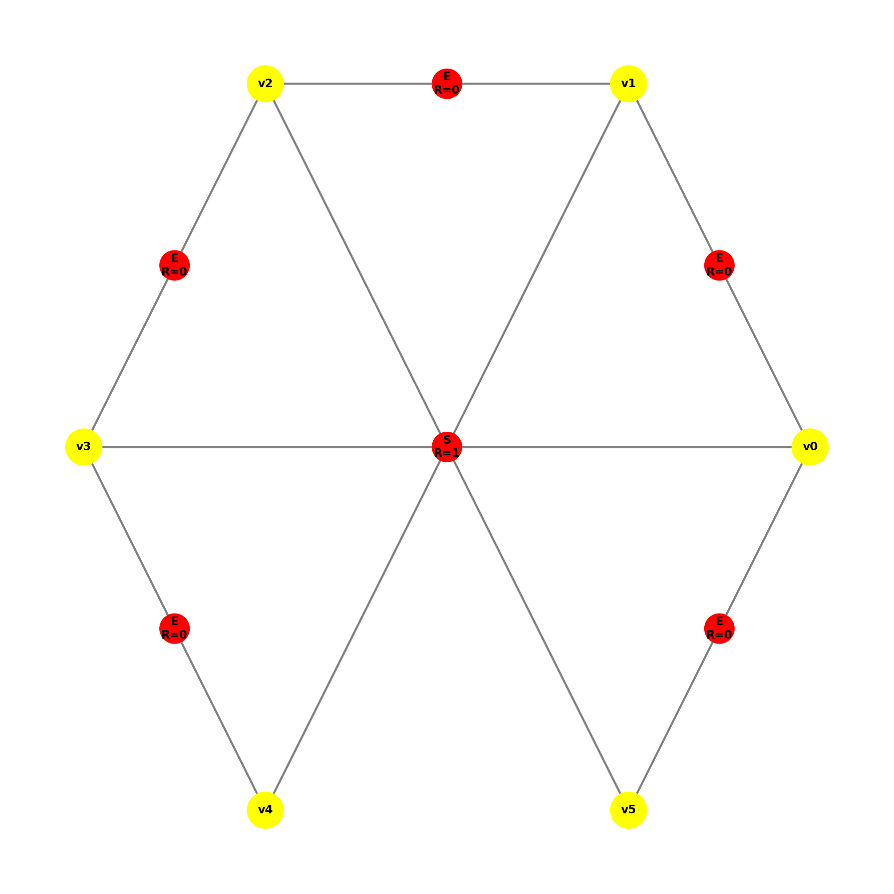
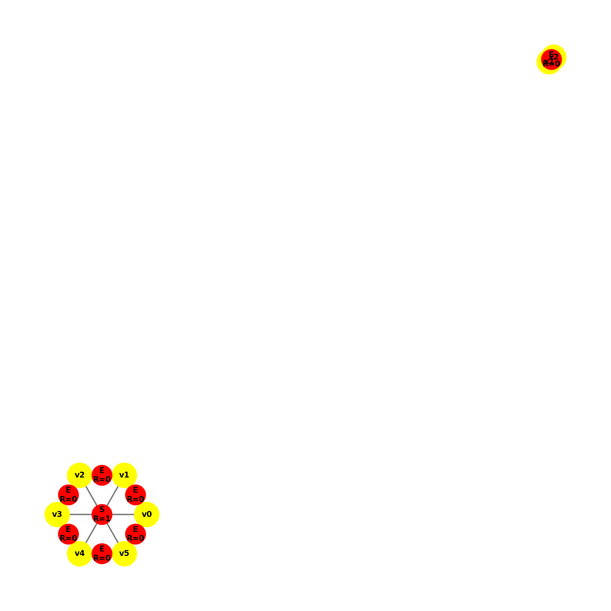

# Dokumentacja produkcji P10

## Opis produkcji

Produkcja **P10** służy do **oznaczenia krawędzi elementu heksagonalnego do podziału**. Jest to etap propagacji informacji o konieczności podziału z wnętrza elementu na jego brzeg.

Jeśli element heksagonalny (reprezentowany przez hiperkrawędź typu `S`) został wcześniej oznaczony do podziału (posiada atrybut `R=1`), produkcja ta nadaje oznaczenie `R=1` wszystkim jego krawędziom brzegowym (hiperkrawędzie typu `E`).

---

## Definicja transformacji

### Lewa strona produkcji (LHS)

Graf wejściowy musi zawierać podgraf izomorficzny ze wzorcem składającym się z:

1. **6 wierzchołków** tworzących strukturę heksagonu.
2. **Hiperkrawędzi wnętrza** o etykiecie `S` (reprezentującej element heksagonalny), która posiada atrybut `R` (Refinement) ustawiony na **1** (`True`).
3. **Hiperkrawędzi brzegowych** o etykiecie `E` łączących wierzchołki heksagonu.

**Warunek stosowalności (`can_apply`):**
Produkcja ma zastosowanie tylko wtedy, gdy:

* Znaleziono hiperkrawędź `S` z `R=1`.
* Węzły tej hiperkrawędzi są połączone krawędziami `E`, z których **przynajmniej jedna** posiada atrybut `R=0` (nie jest jeszcze oznaczona).

### Prawa strona produkcji (RHS)

Po wykonaniu produkcji graf ulega następującym zmianom:

1. **Hiperkrawędź wnętrza (`S`)**: Pozostaje bez zmian (nadal posiada `R=1`).
2. **Hiperkrawędzie brzegowe (`E`)**: Wszystkie krawędzie `E` należące do tego heksagonu otrzymują atrybut `R=1`.
3. Pozostałe atrybuty (np. `B` - boundary) oraz współrzędne wierzchołków pozostają bez zmian.

---

## Schemat graficzny

Na podstawie specyfikacji projektowej:

**Przed (LHS):**

```text
      E(R=?)      E(R=?)
   v2 ------ v3 ------ v4
  /          |          \
E(R=?)       | S(R=1)    E(R=?)
  \          |          /
   v1 ------ v6 ------ v5
      E(R=?)      E(R=?)

```

*(Gdzie przynajmniej jedno E ma R=0)*

**Po (RHS):**

```text
      E(R=1)      E(R=1)
   v2 ------ v3 ------ v4
  /          |          \
E(R=1)       | S(R=1)    E(R=1)
  \          |          /
   v1 ------ v6 ------ v5
      E(R=1)      E(R=1)

```

---

## Szczegóły implementacyjne

### Klasa `P10`

Implementacja znajduje się w pliku `productions/p10.py`.

* **Metoda `can_apply(graph)`:**
Iteruje po hiperkrawędziach typu `S` mających `R=1`. Dla każdego takiego elementu sprawdza, czy posiada on podrzędne krawędzie `E` o wartości `R=0`. Jeśli tak, zwraca `True`.
* **Metoda `find_match(graph)`:**
Znajduje i zwraca referencję do hiperkrawędzi `S`, która spełnia warunki produkcji (jest oznaczona, ale ma nieoznaczone krawędzie).
* **Metoda `get_right_side(matched, level)`:**
Tworzy nowy podgraf, w którym:
  * Kopiuje węzły.
  * Przepisuje krawędź `S` bez zmian.
  * Przepisuje krawędzie `E` należące do tego heksagonu, wymuszając ustawienie `R=1`.
  * Zachowuje oryginalną wartość atrybutu `B` (boundary) dla krawędzi.


---

## Testy

Testy jednostkowe znajdują się w pliku `tests/test_p10.py`. Poniżej przedstawiono wyniki działania poszczególnych przypadków testowych wraz z wizualizacją grafu przed i po zastosowaniu produkcji.

### 1. Test standardowy (`test_apply_isomorphic`)
Sprawdza podstawowy scenariusz: heksagon jest oznaczony do podziału (`S: R=1`), a jego krawędzie nie (`E: R=0`). Po wykonaniu produkcji wszystkie krawędzie powinny otrzymać `R=1`.

| Przed | Po |
| :---: | :---: |
|  |  |

### 2. Test nieoznaczonego elementu (`test_apply_unmarked_S`)
Sprawdza, czy produkcja zostanie zablokowana, jeśli element `S` nie jest przeznaczony do podziału (`R=0`). Oczekiwany brak zmian w grafie (wynik `False`).

| Przed | Po |
| :---: | :---: |
|  |  |

### 3. Test krawędzi już oznaczonych (`test_apply_edges_already_marked`)
Weryfikuje optymalizację: jeśli heksagon i jego krawędzie mają już `R=1`, produkcja nie powinna się wykonać ponownie.

| Przed | Po |
| :---: | :---: |
|  |  |

### 4. Test częściowego oznaczenia (`test_partial_marking`)
Symuluje sytuację, w której część krawędzi została już oznaczona przez sąsiednie elementy. Produkcja powinna uzupełnić oznaczenie `R=1` dla pozostałych krawędzi.

| Przed | Po |
| :---: | :---: |
|  |  |

### 5. Test kontekstu (`test_two_hexagons_context`)
Sprawdza izolację zmian. W grafie z dwoma heksagonami (jeden oznaczony `S: R=1`, drugi nie `S: R=0`), produkcja powinna zmodyfikować tylko krawędzie oznaczonego elementu.

|                                     Przed                                      |                                      Po                                       |
|:------------------------------------------------------------------------------:|:-----------------------------------------------------------------------------:|
|  |  |

### 6. Test błędnej etykiety (`test_wrong_label_S`)
Weryfikuje, czy produkcja poprawnie ignoruje element oznaczony do podziału (`R=1`), ale posiadający błędną etykietę (np. `Q` zamiast `S`).

|                                  Przed                                  | Po |
|:-----------------------------------------------------------------------:| :---: |
|  |  |

### 7. Test niekompletnej topologii (`test_missing_boundary_edge`)
Sprawdza odporność algorytmu na błędy w siatce (brak jednej krawędzi brzegowej). Produkcja powinna oznaczyć pozostałe dostępne krawędzie.

| Przed | Po |
| :---: | :---: |
|  |  |

### 8. Test topologii rozłącznej (`test_disjoint_edge_topology`)
Upewnia się, że produkcja nie oznacza przypadkowych krawędzi `E` (z `R=0`), które znajdują się w grafie, ale nie należą do węzłów przetwarzanego heksagonu.

| Przed | Po |
| :---: | :---: |
|  |  |