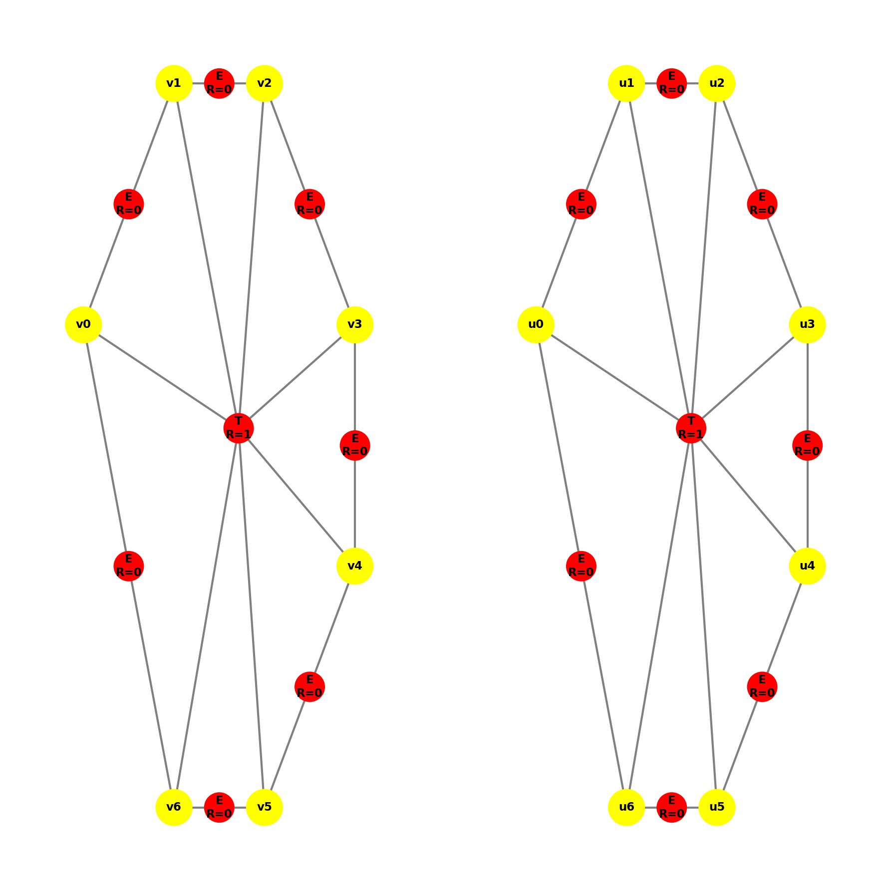
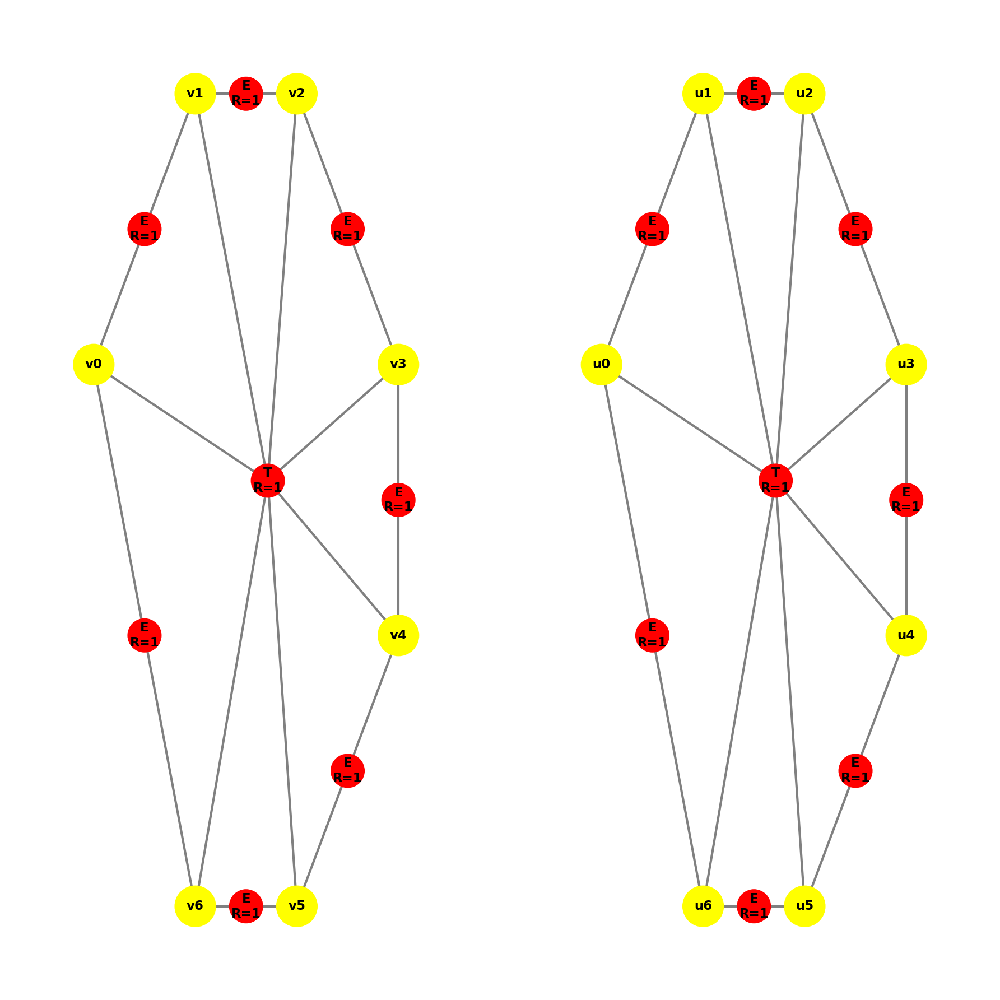
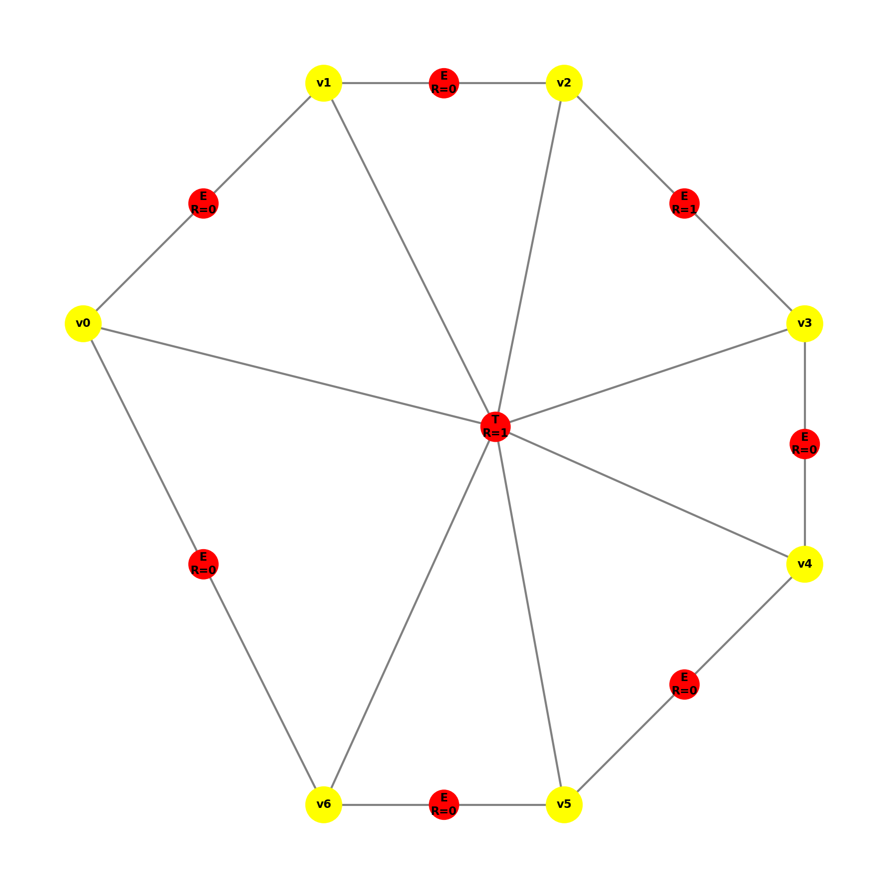
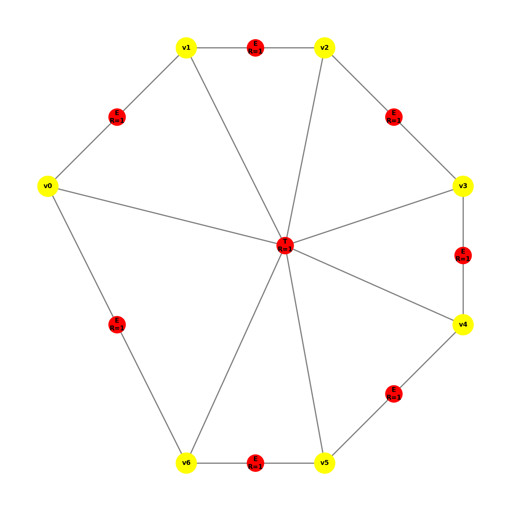

# Dokumentacja produkcji P13

## Opis produkcji

Produkcja **P13** służy do **oznaczenia krawędzi elementu siedmiokątnego do podziału**. Jest to etap propagacji informacji o konieczności podziału z wnętrza elementu na jego brzeg.

Jeśli element siedmiokątny (reprezentowany przez hiperkrawędź typu `T`) został wcześniej oznaczony do podziału (posiada atrybut `R=1`), produkcja ta nadaje oznaczenie `R=1` wszystkim jego siedmiu krawędziom brzegowym (hiperkrawędzie typu `E`).

---

## Definicja transformacji

### Lewa strona produkcji (LHS)

Graf wejściowy musi zawierać podgraf izomorficzny ze wzorcem składającym się z:

1. **7 wierzchołków** tworzących strukturę siedmiokąta.
2. **Hiperkrawędzi wnętrza** o etykiecie `T` (reprezentującej element siedmiokątny), która posiada atrybut `R` (Refinement) ustawiony na **1** (`True`).
3. **Hiperkrawędzi brzegowych** o etykiecie `E` łączących wierzchołki siedmiokąta.

**Warunek stosowalności (`can_apply`):**
Produkcja ma zastosowanie tylko wtedy, gdy:

* Znaleziono hiperkrawędź `T` z `R=1`.
* Węzły tej hiperkrawędzi są połączone krawędziami `E`, z których **przynajmniej jedna** posiada atrybut `R=0` (nie jest jeszcze oznaczona).

### Prawa strona produkcji (RHS)

Po wykonaniu produkcji graf ulega następującym zmianom:

1. **Hiperkrawędź wnętrza (`T`)**: Pozostaje bez zmian (nadal posiada `R=1`).
2. **Hiperkrawędzie brzegowe (`E`)**: Wszystkie 7 krawędzi `E` należące do tego siedmiokąta otrzymują atrybut `R=1`.
3. Pozostałe atrybuty (np. `B` - boundary) oraz współrzędne wierzchołków pozostają bez zmian.

---

## Schemat graficzny

**Przed (LHS):**
Siedmiokąt z hiperkrawędzią centalną `T` ($R=1$) otoczony 7 krawędziami `E`, gdzie przynajmniej jedna ma $R=0$.

**Po (RHS):**
Ten sam siedmiokąt, ale wszystkie 7 krawędzi `E` mają teraz $R=1$.

---

## Szczegóły implementacyjne

### Klasa `P13`

Implementacja znajduje się w pliku `productions/p13.py`.

* **Metoda `can_apply(graph)`:**
Sprawdza czy istnieje hiperkrawędź `T` z $R=1$ otoczona przez 7 krawędzi `E`, z których co najmniej jedna ma $R=0$.
* **Metoda `find_match(graph)`:**
Zwraca hiperkrawędź `T` spełniającą warunki.
* **Metoda `get_right_side(matched, level)`:**
Kopiuje strukturę, zmieniając atrybut $R$ krawędzi `E` na 1.

---

## Wizualizacja

### Przypadek 1: Podstawowa aplikacja
| Przed | Po |
| :---: | :---: |
|  |  |

### Przypadek 2: Wiele siedmiokątów (Lokalność)
Weryfikacja czy produkcja działa lokalnie na jednym elemencie na raz.
| Przed | Po 1. aplikacji | Po 2. aplikacji |
| :---: | :---: | :---: |
|  |  |  |

### Przypadek 3: Częściowe oznaczenie
Jeśli niektóre krawędzie są już oznaczone, produkcja uzupełnia pozostałe.
| Przed | Po |
| :---: | :---: |
|  |  |
