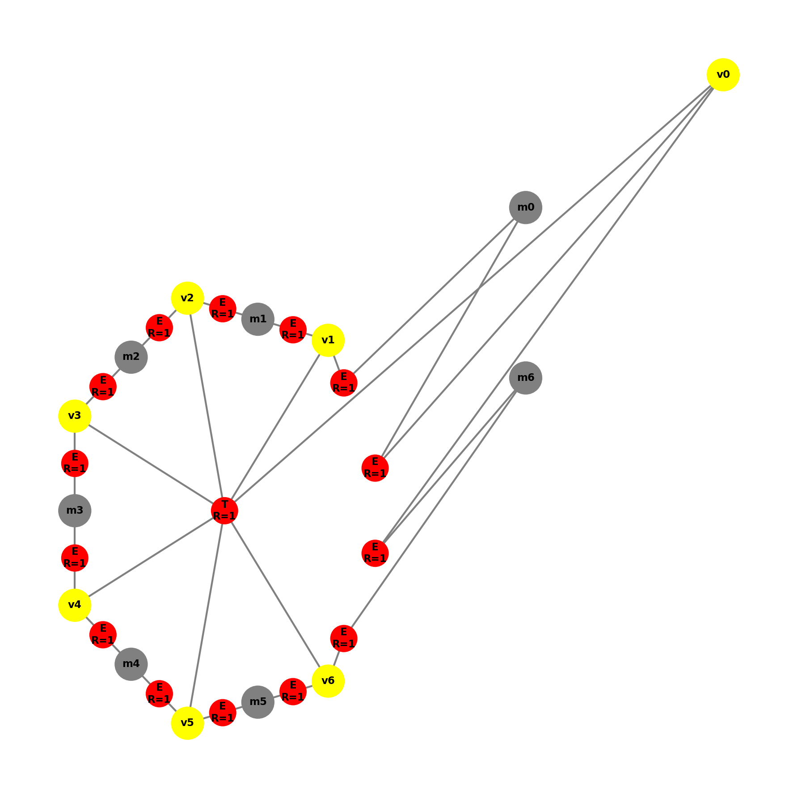
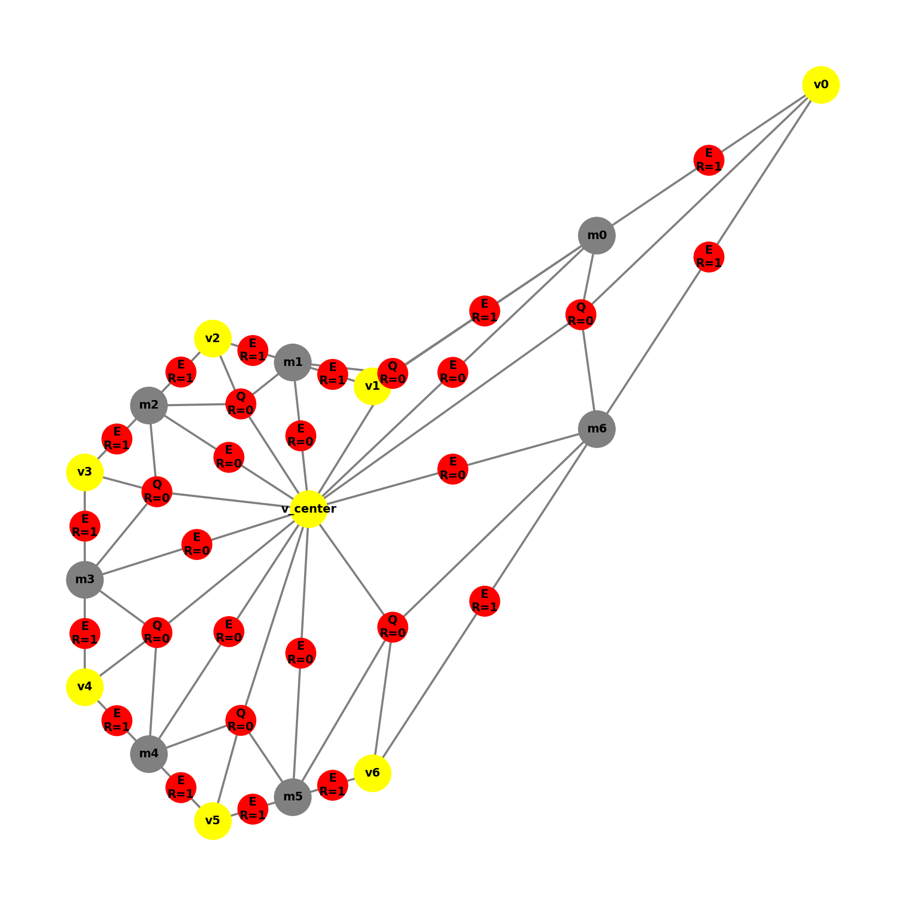
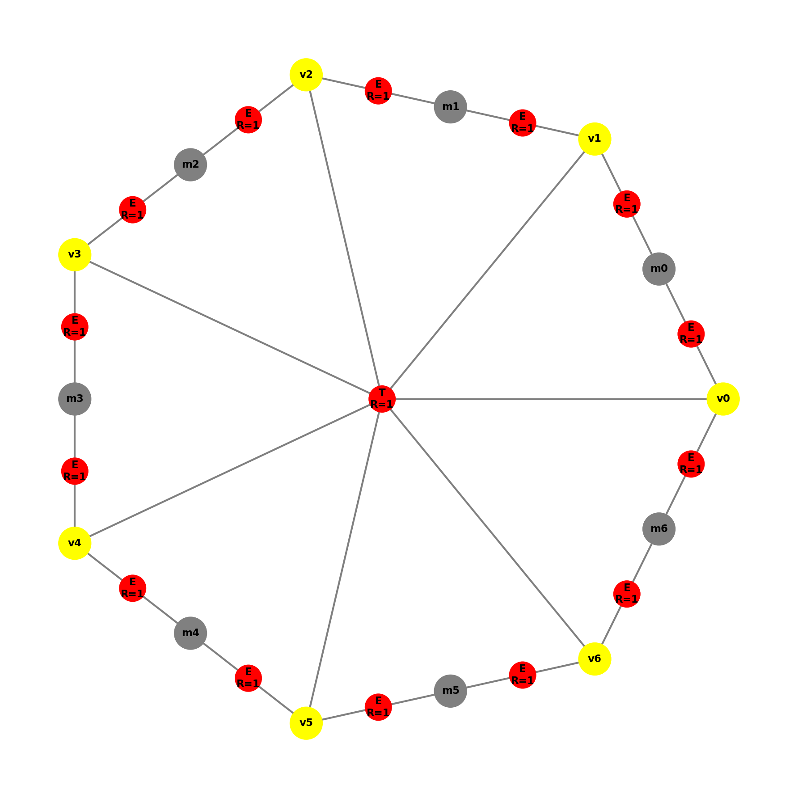
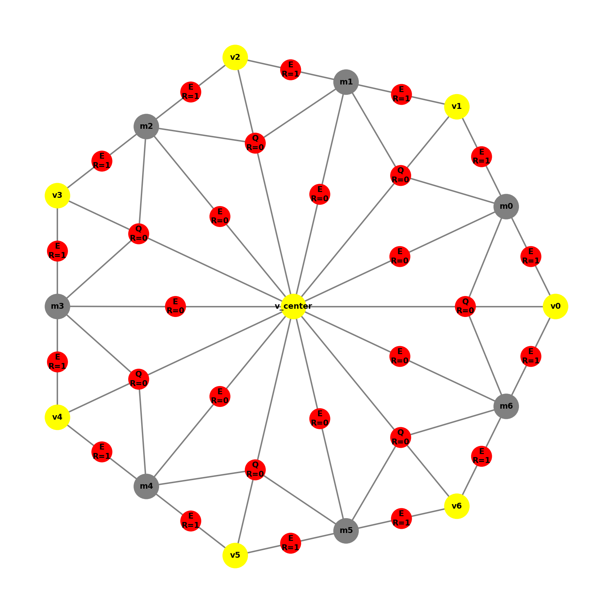

# Dokumentacja produkcji P14

## Opis produkcji

Produkcja **P14** jest operacją finalizującą proces podziału (refinementu) elementu siedmiokątnego. Jest ona stosowana w momencie, gdy otoczenie elementu wymusiło już podział wszystkich jego siedmiu krawędzi brzegowych. Produkcja ta przekształca jeden element siedmiokątny w siedem mniejszych elementów czworokątnych, wykorzystując istniejące węzły wiszące na brzegach.

---

## Lewa strona produkcji (LHS)

Produkcja P14 wyszukuje podgraf o następujących właściwościach:

* **Hiperkrawędź centralna**: typu `T` (Heptagon)
* **R = 1**: element oznaczony do podziału (refinement)
* **7 wierzchołków narożnych**: element musi być rozpięty na dokładnie 7 węzłach
* **7 węzłów wiszących/pośrednich**: na każdym boku siedmiokąta musi znajdować się węzeł wiszący/pośredni, połączony krawędziami `E` z sąsiednimi narożnikami.

---

## Prawa strona produkcji (RHS)

Po zastosowaniu produkcji P14:

1. Tworzony jest nowy **węzeł centralny** w środku geometrycznym siedmiokąta.
   * `x = (\sum x_i) / 7`
   * `y = (\sum y_i) / 7`
2. Węzeł centralny łączony jest krawędziami wewnętrznymi (`boundary=False`) ze wszystkimi węzłami pośrednimi.
3. Oryginalna hiperkrawędź `T` zostaje usunięta.
4. Powstaje **7 nowych elementów czworokątnych** (typu `Q`).
5. Nowe elementy mają **R=0** (nie są już oznaczone do podziału).

Każdy element `Q` jest zdefiniowany przez czwórkę węzłów: `[center, h_prev, corner, h_next]`.

---

## Szczegóły implementacyjne

### Klasa `P14`

Implementacja znajduje się w pliku `productions/p14.py`.

* **Metoda `find_match(graph)`:**
  Szuka hiperkrawędzi `T` z $R=1$. Następnie weryfikuje obecność 7 punktów pośrednich, które muszą leżeć na krawędziach `E` łączących narożniki i spełniać warunek współliniowości.
* **Metoda `get_right_side(matched, level)`:**
  1. Wyznacza środek ciężkości.
  2. Sortuje narożniki kątowo względem środka.
  3. Mapuje krawędzie na punkty pośrednie.
  4. Tworzy 7 hiperkrawędzi `Q`.
  5. Dodaje krawędzie wewnętrzne `E` łączące środek z punktami pośrednimi.

---

## Wizualizacja

### Przypadek 1: Podstawowa aplikacja
| Przed | Po |
| :---: | :---: |
|  |  |

### Przypadek 2: Zniekształcona geometria
Produkcja poprawnie rozpoznaje punkty pośrednie nawet przy nieregularnych współrzędnych, o ile zachowana jest współliniowość.
| Przed | Po |
| :---: | :---: |
|  |  |

### Przypadek 3: Zachowanie atrybutów brzegowych
Weryfikacja czy atrybuty `B` (boundary) krawędzi zewnętrznych są kopiowane do grafu wynikowego.
| Przed | Po |
| :---: | :---: |
|  |  |
