# Gramatyka Hipergrafów - Dokumentacja produkcji P2 oraz P6

Autorzy: Adam Górka, Łukasz Dydek

---

## Produkcja P2

## Gramatyka Hipergrafów

**Produkcja P2** to etap kończący podział (rozdrabnianie) krawędzi. Jest stosowana w momencie, gdy długa krawędź jest oznaczona do podziału ($R=1$), a jej struktura geometryczna została już przygotowana (istnieje węzeł w środku). Produkcja ta usuwa starą krawędź, zostawia dwie, które już istniały i zmienia im wartość $R$ na **0**, finalizując podział.

---

## Lewa strona produkcji

### Warunki izomorfizmu:
1. Musi istnieć krawędź łącząca dokładnie **2** wierzchołki.
2. Krawędź musi być typu `E`
3. Krawędź musi mieć atrybut $R=1$
4. Krawędź musi mieć atrybut $B=0$
5. Dwa wierzchołki krawędzi (`u`, `v`) połączone są przez dwie inne krawędzie przechodzące przez oddzielny wierzchołek `w`, którego współrzędne spełniają następujące zależności:
    * $w.x=\frac{u.x+v.x}{2}$
    * $w.y=\frac{u.y+v.y}{2}$
```
      v2 (x2, y2, z2)
      |  \ 
      |    \---
      |    | E |
      |     ---
      |        \  
     ---         \
R=1 | E |         v3 ((x1+x2)/2, (y1+y2)/2, (z1+z2)/2))
B=0  ---         /
      |        /
      |     ---
      |    | E |
      |    /---
      |  /
      v1 (x1, y1, z1)
```

## Prawa strona produkcji

Po zastosowaniu produkcji P2:

1. Usunięta jest krawędź z oznaczeniami $R=1, B=0$
2. Pozostałe krawędzie mają zmienioną wartość $R$ na 0

```
      v2 (x2, y2, z2)
      |
     ---   
    | E | R=0
     ---   
      |  
      |  
      v3 ((x1+x2)/2, (y1+y2)/2, (z1+z2)/2)
      |  
      |  
     ---
    | E | R=0
     ---
      | 
      v1 (x1, y1, z1)
```
---

## Implementacja

### Sprawdzanie izomorfizmu z lewą stroną produkcji

Metoda `can_apply()` wykorzystuje metodę `find_match()`, aby sprawdzić czy podgraf jest izomorficzny z lewą stroną produkcji:

```python
def can_apply(self, graph: Graph) -> bool:
    return self.find_match(graph) is not None

def find_match(self, graph: Graph) -> Optional[HyperEdge]:
    for e1 in graph.hyperedges:
        if e1.hypertag == "E" and e1.R == 1 and e1.B == 0 and len(e1.nodes) == 2:
            u, v = e1.nodes[0], e1.nodes[1]

            target_x = (u.x + v.x) / 2
            target_y = (u.y + v.y) / 2

            w = next((n for n in graph.nodes if math.isclose(n.x, target_x)
                      and math.isclose(n.y, target_y) and n not in (u, v)), None)

            if w:
                has_u_w = any(set(e.nodes) == {u, w} for e in graph.hyperedges)
                has_v_w = any(set(e.nodes) == {v, w} for e in graph.hyperedges)

                if has_u_w and has_v_w:
                    return HyperEdge((u, v, w), "E", R=1, B=0)
    return None
```
 
#### Produkcja jest stosowana do pierwszej znalezionej krawędzi spełniającej warunki.

### Tworzenie prawej strony produkcji

```python
def get_right_side(self, matched: Graph, level: int) -> Graph:
    main_edge = next(e for e in matched.hyperedges if e.R == 1)
    u, v = main_edge.nodes[0], main_edge.nodes[1]

    w = next(n for n in matched.nodes if n not in (u, v))

    result = Graph()

    for n in [u, v, w]:
        result.add_node(n)

    result.add_edge(HyperEdge((u, w), "E", R=0, B=main_edge.B))
    result.add_edge(HyperEdge((w, v), "E", R=0, B=main_edge.B))

    return result
```

#### Prawa strona produkcji charakteryzuje się następującymi cechami:
1. Liczba wierzchołków pozostaje stała
2. Liczba krawędzi zostaje zmniejszona o 1
3. Krawędzie, które pozostały przyjmują nowe wartości atrybutów `R=0,  B=B1`
4. Współrzędne wierzchołków pozostają niezmienione
---

## Przeprowadzenie Testów

#### Opis Testów Jednostkowych
Wszystkie testy zostały przeprowadzone przy użyciu frameworka `unittest`. Ich celem jest weryfikacja poprawności działania mechanizmu izomorfizmu (metoda `can_apply`) oraz samej transformacji grafu (metoda `apply`)

### 1. Sprawdzenie wykrywalności poprawnego grafu (`test_can_apply_positive`)
- **Cel**: Weryfikacja, czy produkcja poprawnie rozpoznaje graf, który jest w pełni zgodny z lewą stroną (LHS).
- **Scenariusz**: Tworzony jest graf bazowy zawierający krawędź $R=1$ oraz wierzchołek pośredni połączony odpowiednimi krawędziami.
- **Oczekiwany wynik**: Funkcja `can_apply` zwraca `True`.

#### Wygenerowany obrazek:
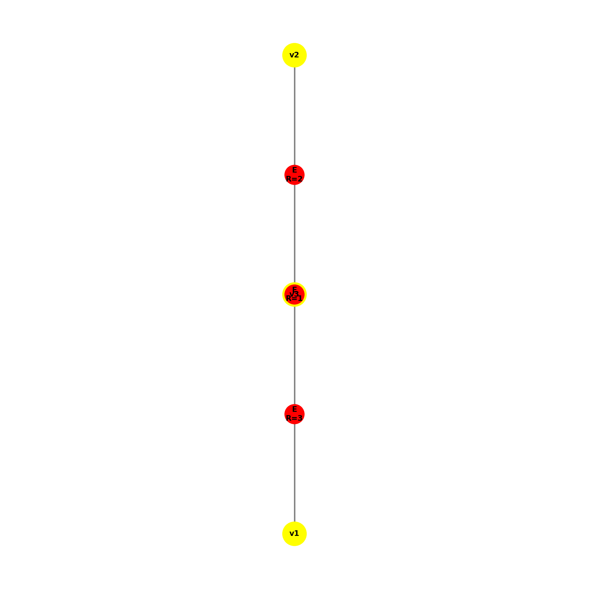

**Uwaga:**
Ze względu na fakt, że współrzędne wierzchołka środkowego są wyliczane jako średnia arytmetyczna położeń wierzchołków skrajnych, na wygenerowanym schemacie etykieta wierzchołka pokrywa się z etykietą hiperkrawędzi łączącej wierzchołki $v_1$ i $v_2$.

### 2. Brak wierzchołka środkowego (`test_missing_vertex_fails`)
- **Cel**: Sprawdzenie, czy brak wierzchołka $v_3$ (środkowego) blokuje produkcję.
- **Scenariusz**: Z grafu wzorcowego usuwany jest wierzchołek znajdujący się w punkcie $(\frac{x_1+x_2}{2}, \frac{y_1+y_2}{2})$.
- **Oczekiwany wynik**: Funkcja `can_apply` zwraca `False`.

#### Wygenerowany obrazek:
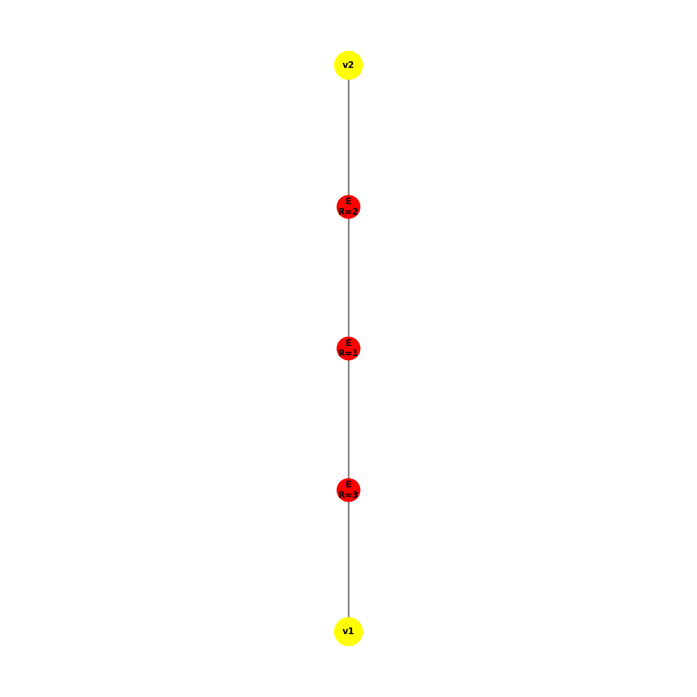

### 3. Błędna geometria wierzchołka pośredniego (`test_wrong_geometry_fails`)
- **Cel**: Weryfikacja rygoru geometrycznego produkcji.
- **Scenariusz**: Wierzchołek $v_3$ zostaje umieszczony na linii między $v_1$ i $v_2$, ale w innym miejscu niż dokładnie połowa odległości (np. w 75% długości).
- **Oczekiwany wynik**: Funkcja `can_apply` zwraca `False` ze względu na niespełnienie warunku średniej arytmetycznej współrzędnych.

#### Wygenerowany obrazek:
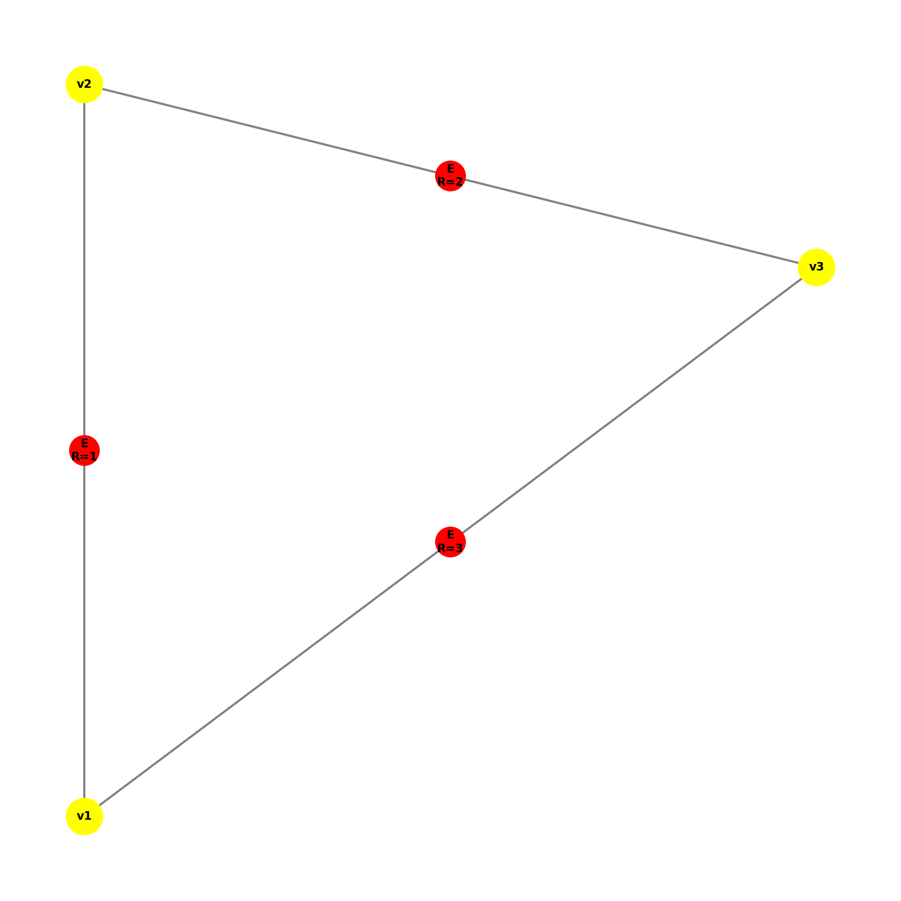

### 4. Brak krawędzi bocznej (`test_missing_edge_breaks_isomorphism`)
- **Cel**: Sprawdzenie, czy kompletność krawędzi bocznych jest wymagana.
- **Scenariusz**: Usuwana jest jedna z krawędzi typu E łącząca wierzchołek środkowy z wierzchołkiem skrajnym.
- **Oczekiwany wynik**: Produkcja nie może zostać zaaplikowana.

#### Wygenerowany obrazek:
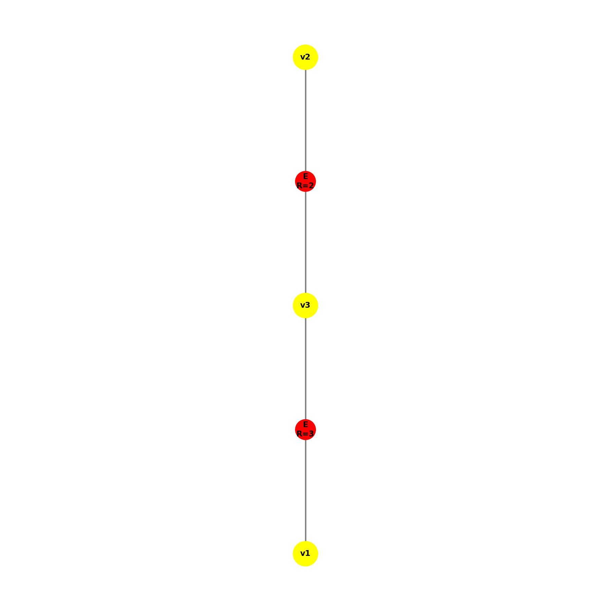


### 5. Niepoprawne atrybuty krawędzi (`test_wrong_attributes_fails`)
- **Cel**: Weryfikacja wrażliwości na atrybuty hiperkrawędzi.
- **Scenariusz**: Główna krawędź łącząca $v_1$ i $v_2$ ma zmieniony atrybut $R$ z $1$ na $0$.
- **Oczekiwany wynik**: `can_apply` zwraca `False`, ponieważ produkcja P2 służy wyłącznie do finalizacji podziału krawędzi oznaczonych jako $R=1$.

#### Wygenerowany obrazek:
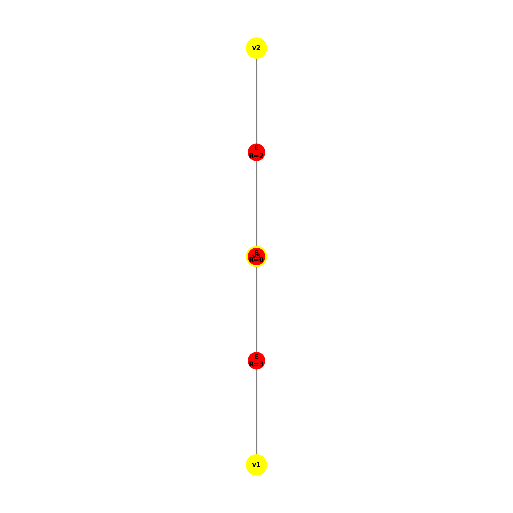

### 6. Poprawność transformacji strukturalnej (`test_transformation_correctness`)
- **Cel**: Sprawdzenie, czy stan grafu po aplikacji produkcji odpowiada prawej stronie (RHS).
- **Scenariusz**: Wykonanie `g.apply(prod)` na poprawnym grafie.
- **Oczekiwany wynik**: 
  - Stara krawędź $R=1$ zostaje usunięta.
  - W grafie pozostają 2 krawędzie krawędziowe.
  - Wszystkie krawędzie mają teraz atrybut $R=0$.

#### Wygenerowane obrazki:
Graf **przed** transformacją:

Graf **po** transformacji:
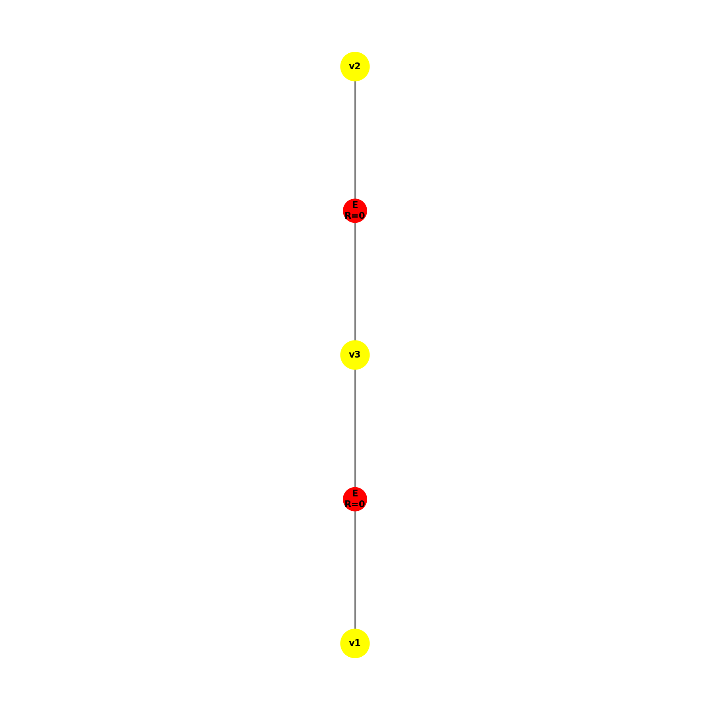

### 7. Stabilność współrzędnych wierzchołków (`test_vertex_coordinates_preserved`)
- **Cel**: Upewnienie się, że produkcja jest stabilna geometrycznie i nie przesuwa punktów w przestrzeni.
- **Scenariusz**: Porównanie współrzędnych $(x, y)$ wszystkich wierzchołków przed i po transformacji.
- **Oczekiwany wynik**: Współrzędne są identyczne co do bita.

### 8. Brak połączeń między elementami (`test_missing_adjacent_edges_fails`)
- **Cel**: Sprawdzenie, czy sama obecność wierzchołka w środku wystarczy do podziału (nie powinna).
- **Scenariusz**: Istnieje krawędź $R=1$ i wierzchołek $v_3$ w połowie drogi, ale nie są one połączone krawędziami bocznymi.
- **Oczekiwany wynik**: Brak dopasowania (wymagana jest pełna struktura grafu).

#### Wygenerowany obrazek:


### 9. Aplikacja wewnątrz większego grafu (`test_embedded_in_larger_graph`)
- **Cel**: Weryfikacja działania mechanizmu w kontekście większego, złożonego grafu.
- **Scenariusz**: Do struktury P2 dołączane są dodatkowe wierzchołki i krawędzie, które nie biorą udziału w produkcji.
- **Oczekiwany wynik**: Produkcja znajduje poprawny podgraf i modyfikuje tylko jego elementy, nie naruszając reszty struktury.

#### Wygenerowane obrazki:
Graf **przed** aplikacją:

Graf **po** aplikacji:


### 10. Wybór jednego kandydata z wielu (`test_multiple_candidates_only_one_applied`)
- **Cel**: Sprawdzenie zachowania przy wielu potencjalnych miejscach aplikacji.
- **Scenariusz**: Graf zawiera dwa rozłączne miejsca, w których można zastosować produkcję P2.
- **Oczekiwany wynik**: Jednorazowe wywołanie `apply()` zmienia tylko jeden obszar, pozostawiając drugi do kolejnej iteracji (zgodnie z logiką systemów gramatycznych).

#### Wygenerowane obrazki:
Graf **przed** wyborem i aplikacją:
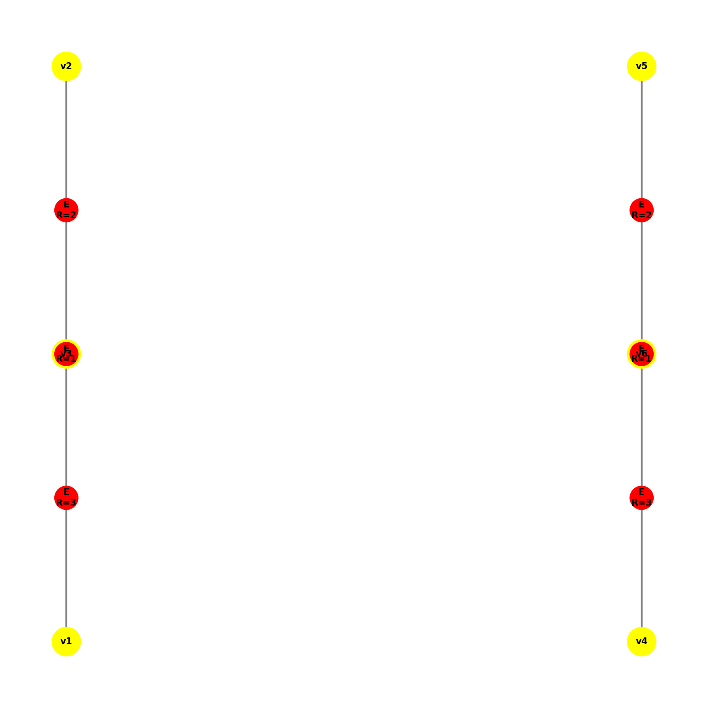
Graf **po** aplikacji:
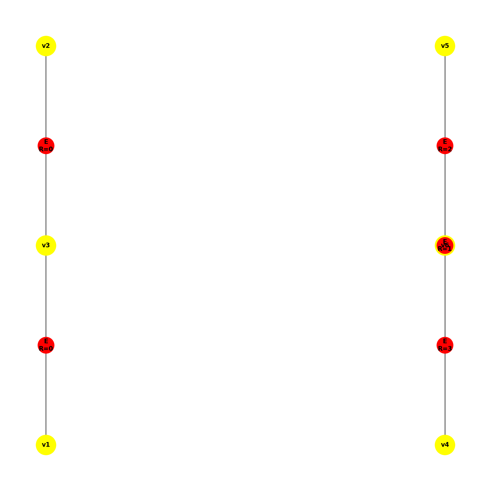


### 11. Rozpoznawanie etykiet hiperkrawędzi (`test_no_match_with_different_label`)
- **Cel**: Sprawdzenie szczelności filtrów etykiet.
- **Scenariusz**: Struktura geometryczna i atrybuty $R, B$ są poprawne, ale krawędzie mają etykietę `Q` zamiast `E`.
- **Oczekiwany wynik**: Produkcja ignoruje takie krawędzie.

#### Wygenerowany obrazek:
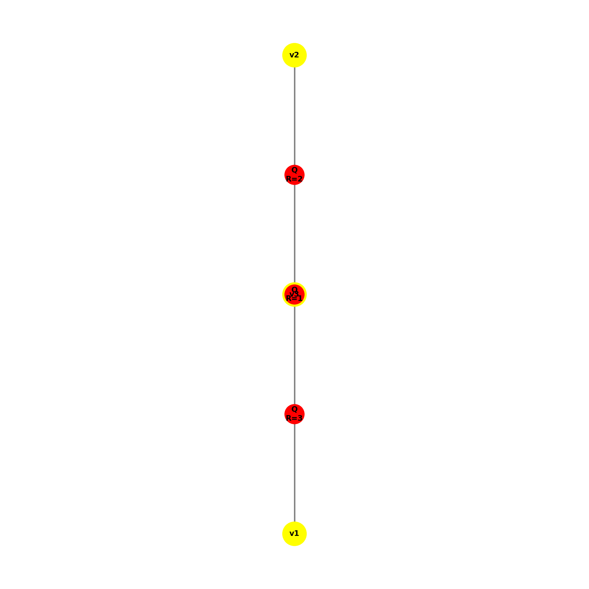


### Wyniki testów:

11 tests `passed`/ 11 tests `total`

## Pokrycie wymagań testowych

### Weryfikacja izomorfizmu produkcji z lewą stroną

| Wymaganie                                                |Status     |Testy       |
|----------------------------------------------------------|-----------|------------|
| Czy wykrywa graf izomorficzny z lewą stroną              |✅          |#1, #9, #10 |
| Brak wierzchołka środkowego blokuje produkcję            |✅          |#2          |
| Brak wymaganej krawędzi blokuje produkcję         |✅          |#4, #8      |
| Zła geometria (wierzchołek nie w środku) blokuje produkcję |✅          |#3          |
| Zmiana etykiety (tagu) na inny niż `E` blokuje produkcję  |✅          |#11         |
| Niezgodność atrybutów ($R=1$) blokuje produkcję          |✅          |#5          |


### Poprawność wykonania transformacji przez produkcję

| Wymaganie                                                   |Status     |Testy       |
|-------------------------------------------------------------|-----------|------------|
| Krawędź ($R=1$) zostaje poprawnie usunięta                  |✅          |#6          |
| Nowe krawędzie mają poprawne atrybuty ($R=0,B=0$)           |✅          |#6          |
| Liczba wierzchołków pozostaje stała                         |✅          |#6          |
| Pozycje wierzchołków nie ulegają zmianie                    |✅          |#7          |
| Produkcja modyfikuje tylko jeden podgraf na raz (atomowość) |✅          |#10         |


### Poprawność wizualizacji grafu po transformacji

|Wymaganie|Status     | Testy              |
|---------|-----------|--------------------|
|Wizualizacja poprawnie generuje pliki przed i po transformacji|✅          | #1 - #6, #8 - #11  |
|Wierzchołki zachowują spójność wizualną z danymi|✅          | #3, #6, #9, #10     |

### Charakterystyka zestawów testowych grafów

|Wymaganie                               |Status|Testy|
|----------------------------------------|------|-----|
|Graf wzorcowy (minimalny pasujący)      |✅     |#1   |
|Graf osadzony w większej strukturze     |✅     |#9   |
|Graf z wieloma kandydatami do produkcji |✅     |#10  |
|Graf z błędną geometrią (zniekształcony)|✅     |#3   |
|Graf z błędnymi atrybutami krawędzi     |✅     |#5   |
|Graf z niepoprawnymi etykietami         |✅     |#11  |


### Weryfikacja poprawności wyniku po zastosowaniu produkcji

|Wymaganie                               |Status|Testy|
|----------------------------------------|------|-----|
|Produkcja nie uruchamia się na niepełnych strukturach|✅     |#2, #4, #8|
|Produkcja nie uszkadza elementów zewnętrznych|✅     |#9   |
|Sprawdzenie liczby krawędzi po transformacji|✅     |#6   |
|Weryfikacja niezmienności współrzędnych (stabilność geometryczna)|✅     |#7   |

## Uruchomienie testów

```bash
# Będąc w głównym katalogu
python tests/test_p2.py
```

---

## Produkcja P6

**Produkcja P6** jest operacją sterującą procesem zagęszczania siatki (refinement). Jej zadaniem jest oznaczenie elementu centralnego (pięciokąta) do podziału poprzez zmianę atrybutu $R$ z **0** na **1**.

---

## Lewa strona produkcji

### Warunki izomorfizmu:
Produkcja P6 znajduje podgraf, który posiada następujące cechy:
* **Istnienie hiperkrawędzi**: 
  * typu `P`
  * połączonej z 5-cioma wierzchołkami
  * z atrybutem $R = 0$ (element nie jest jeszcze oznaczony do podziału)
```
                   ---
     v4 ----------| E |--------- v3
      | \          ---          /  \ 
      |   \                   /      \---
      |     \               /        | E |
      |       \           /           ---
      |         \  R=0  /                \  
     ---          \---/                    \
    | E |         | P |-------------------- v5
     ---          /---\                     /
      |         /       \                 /
      |       /           \           ---
      |     /               \        | E |
      |   /                   \      /---
      | /          ---          \  /
     v1 ----------| E |--------- v2
                   ---
```

## Prawa strona produkcji

Po zastosowaniu produkcji P6:
- Hiperkrawędź typu `P` zmienia wartość atrybutu $R$ na **1**.
- Wszystkie pozostałe elementy grafu (wierzchołki, krawędzie boczne `E`, ich atrybuty `B`) pozostają niezmienione.

```
                   ---
     v4 ----------| E |--------- v3
      | \          ---          /  \ 
      |   \                   /      \---
      |     \               /        | E |
      |       \           /           ---
      |         \  R=1  /                \  
     ---          \---/                    \
    | E |         | P |-------------------- v5
     ---          /---\                     /
      |         /       \                 /
      |       /           \           ---
      |     /               \        | E | 
      |   /                   \      /---
      | /          ---          \  /
     v1 ----------| E |--------- v2
                   ---
```
---

## Implementacja

### Sprawdzanie izomorfizmu z lewą stroną produkcji

Metoda `find_match()` weryfikuje strukturę Pentagonu:

```python
def find_match(self, graph: Graph) -> Optional[HyperEdge]:
    for p_edge in graph.hyperedges:
        if p_edge.hypertag == "P" and len(p_edge.nodes) == 5 and p_edge.R == 0:
            return p_edge
    return None

def can_apply(self, graph: Graph) -> bool:
    return self.find_match(graph) is not None
```

#### Produkcja jest stosowana do pierwszej znalezionej hiperkrawędzi spełniającej powyższe warunki.

### Tworzenie prawej strony produkcji

```python
def get_right_side(self, matched: Graph, level: int) -> Graph:
    old_p_edge = next(e for e in matched.hyperedges if e.hypertag == "P")

    result = Graph()
    for node in matched.nodes:
        result.add_node(node)

    for edge in matched.hyperedges:
        if edge.hypertag == "E":
            result.add_edge(edge)

    result.add_edge(HyperEdge(old_p_edge.nodes, "P", R=1))

    return result
```
#### Prawa strona produkcji charakteryzuje się następującymi cechami:
1. Liczba wierzchołków pozostaje stała.
2. Atrybut $R$ hiperkrawędzi typu `P` zmienia wartość z **0** na **1**.
3. Wszystkie krawędzie typu `E` oraz ich atrybuty ($R, B$) pozostają niezmienione.
4. Współrzędne wierzchołków pozostają niezmienione.

---

## Przeprowadzone Testy

#### Opis Testów Jednostkowych
Wszystkie testy zostały przeprowadzone przy użyciu frameworka `unittest`. Ich celem jest weryfikacja poprawności działania mechanizmu izomorfizmu (metoda `can_apply`) oraz samej transformacji grafu (metoda `apply`).

### 1. Sprawdzenie poprawnej aplikacji przy spełnionym RFC (`test_transformation_success`)
- **Cel**: Weryfikacja zmiany atrybutu $R$ z 0 na 1, gdy warunek wymuszenia podziału jest spełniony.
- **Scenariusz**: Graf posiada hiperkrawędź $P$ ($R=0$), wierzchołki są połączone hiperkrawędziami $E$ oraz spełniony jest warunek RFC.
- **Oczekiwany wynik**: Funkcja zwraca sukces, a $R$ hiperkrawędzi $P$ wynosi **1**.

#### Wygenerowane obrazki:
Graf **przed** aplikacją:
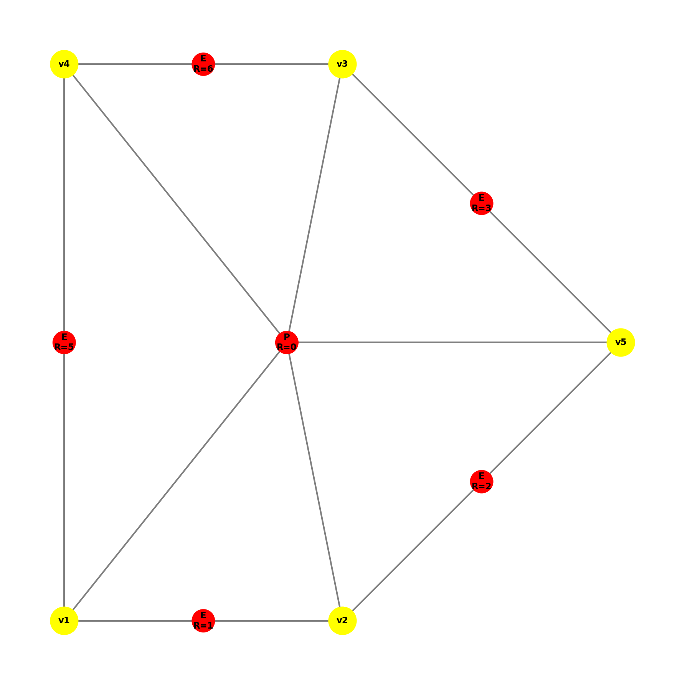
Graf **po** aplikacji:


### 2. Blokada dla krawędzi już oznaczonych (`test_already_marked_fails`)
- **Cel**: Upewnienie się, że produkcja nie aplikuje się do elementów, które mają już $R=1$.
- **Scenariusz**: Pentagon posiada atrybut $R=1$.
- **Oczekiwany wynik**: Wynik aplikacji wynosi **0**.

#### Wygenerowany obrazek:
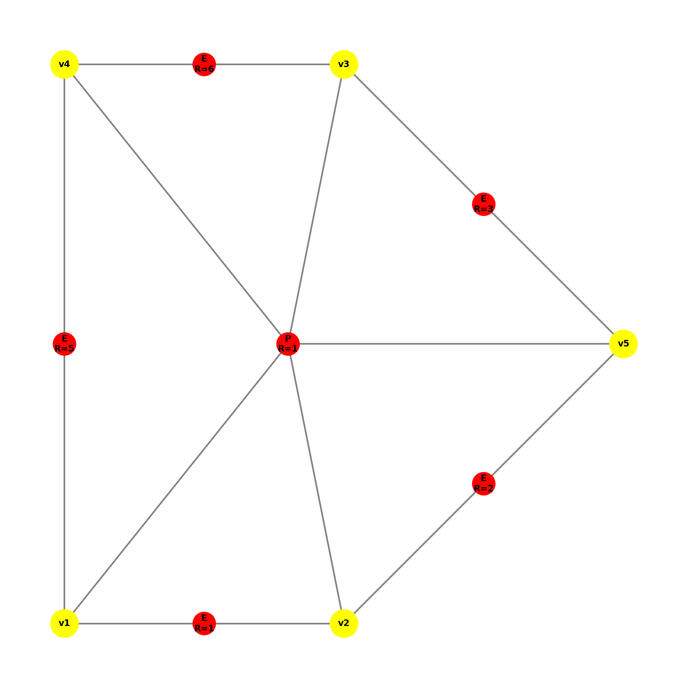

### 3.Błędna topologia (`test_wrong_topology_fails`)
- **Cel**: Weryfikacja wymogu posiadania dokładnie 5 węzłów.
- **Scenariusz**: Tworzony jest graf, gdzie krawędź $P$ łączy 4 węzły.
- **Oczekiwany wynik**: `can_apply` zwraca `False`.

#### Wygenerowany obrazek:
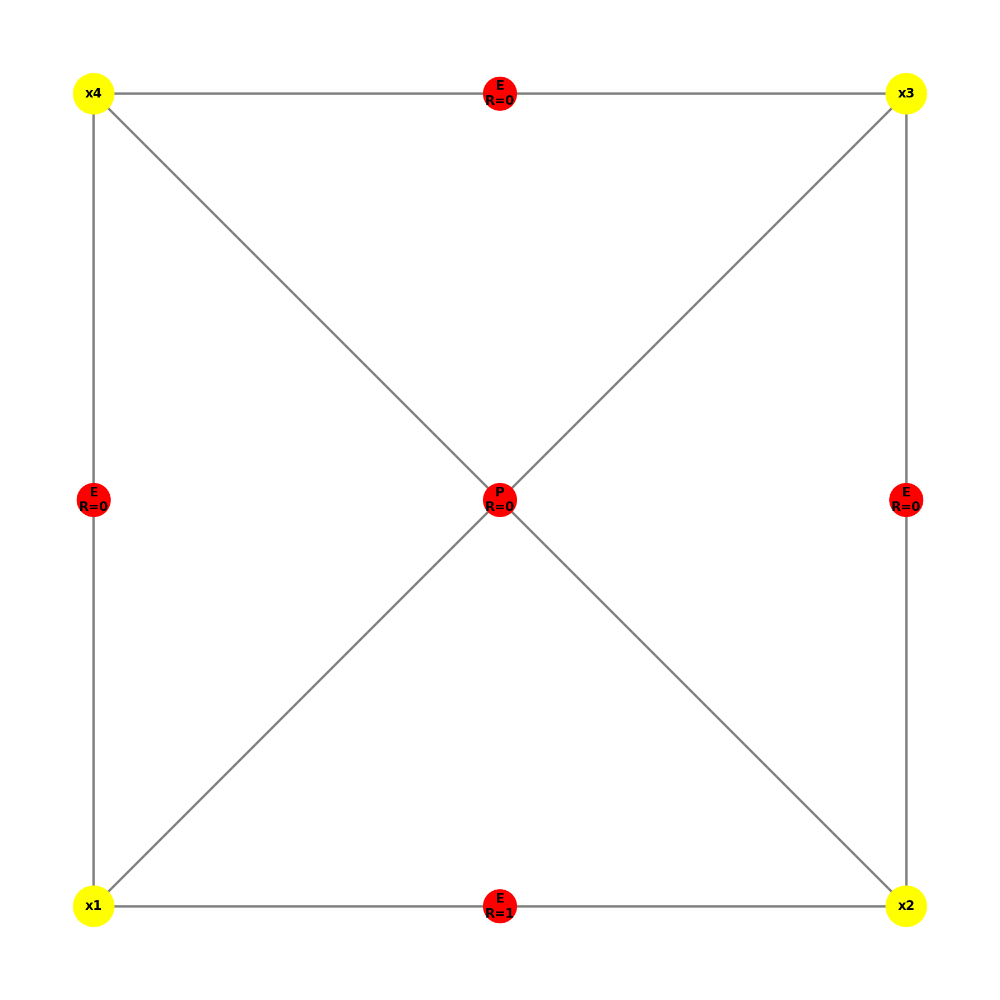

### 4. Stabilność współrzędnych (`test_vertex_coordinates_preserved`)
- **Cel**: Sprawdzenie, czy produkcja nie przesuwa punktów w przestrzeni.
- **Scenariusz**: Porównanie współrzędnych przed i po transformacji.
- **Oczekiwany wynik**: Współrzędne są identyczne.

### 5. Osadzenie w większym grafie (`test_embedded_in_larger_graph`)
- **Cel**: Weryfikacja działania mechanizmu w złożonym otoczeniu.
- **Scenariusz**: Pentagon współdzieli krawędzie z dodatkowymi strukturami (np. kwadratem).
- **Oczekiwany wynik**: Produkcja modyfikuje tylko pentagon, nie naruszając struktur zewnętrznych.

#### Wygenerowane obrazki:
Graf **przed** aplikacją:

Graf **po** aplikacji:
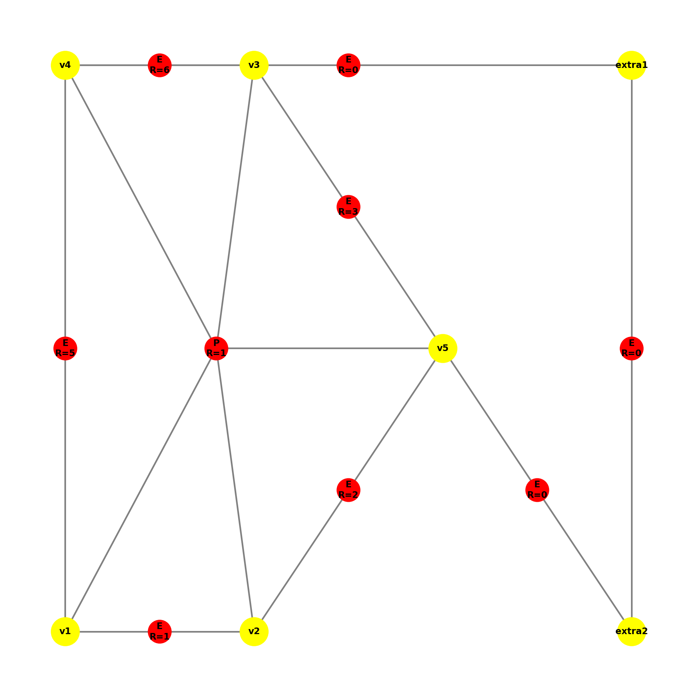

### 6. Wiele kandydatów i atomowość (`test_multiple_candidates`)
- **Cel**: Sprawdzenie, czy w jednym kroku modyfikowany jest tylko jeden pentagon.
- **Scenariusz**: Graf zawiera dwa pentagony spełniające warunki LHS.
- **Oczekiwany wynik**: Po jednej aplikacji liczba pentagonów z $R=0$ spada z 2 do 1.

#### Wygenerowane obrazki:
Graf **przed** aplikacją:

Graf **po** aplikacji:
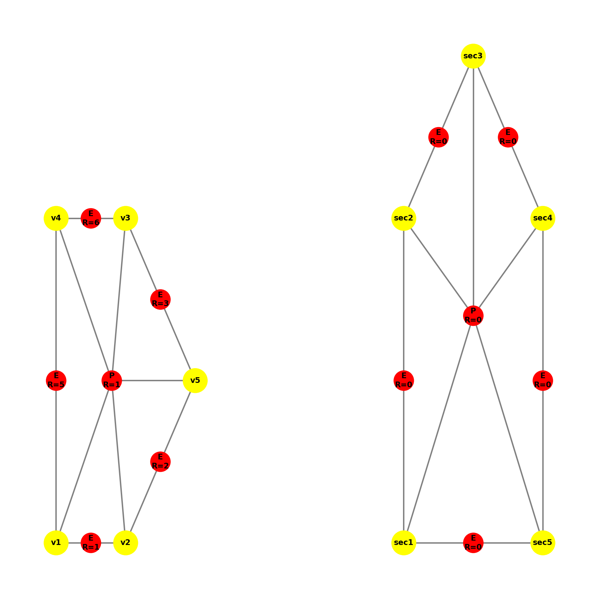

### 7. Szczelność filtrów etykiet (`test_no_match_with_similar_label`)
- **Cel**: Sprawdzenie, czy etykiety inne niż `P` są ignorowane.
- **Scenariusz**: Graf posiada strukturę 5-węzłową z etykietą `Q`.
- **Oczekiwany wynik**: `can_apply` zwraca `False`.

#### Wygenerowany obrazek:
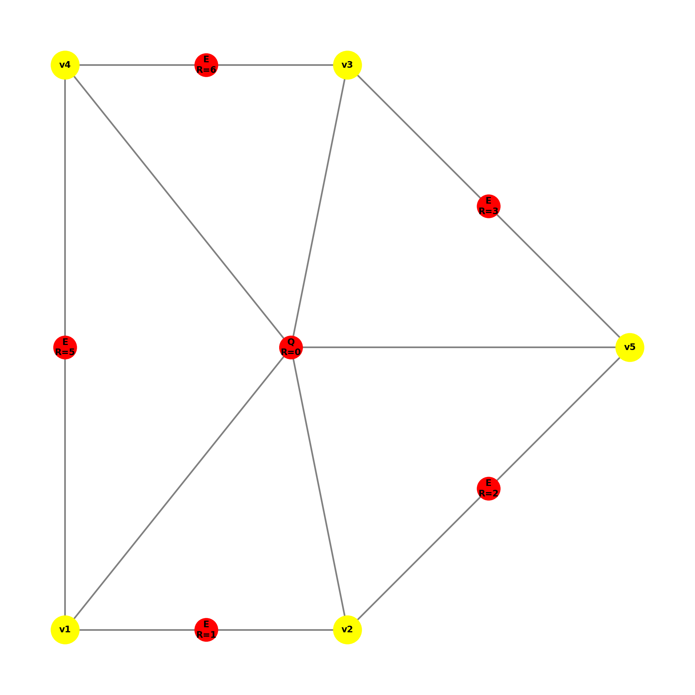

### 8. Zachowanie warunków brzegowych (`test_preserves_boundary_conditions`)
- **Cel**: Sprawdzenie, czy produkcja nie uszkadza atrybutów $B$ na krawędziach.
- **Scenariusz**: Porównanie wartości $B$ przed i po aplikacji.
- **Oczekiwany wynik**: Wartości $B$ pozostają **niezmienione**.

### 9. Zachowanie liczby wierzchołków (`test_number_of_vertices`)
- **Cel**: Sprawdzenie, czy po produkcji liczba wierzchołków pozostaje stała.
- **Scenariusz**: Porównanie liczby wierzchołków grafu przed dokonaniem aplikacji produkcji oraz po produkcji.
- **Oczekiwany wynik**: Wartość `len(g.nodes)` pozostaje stała.

### Wyniki testów:

9 tests `passed` / 9 tests `total`

## Pokrycie wymagań testowych

### Poprawność weryfikacji izomorfizmu z lewą stroną produkcji

| Wymaganie                                                                |Status| Testy      |
|--------------------------------------------------------------------------|------|------------|
| Czy wykrywa graf izomorficzny z lewą stroną (LHS)                        |✅     | #1, #5, #6 |
| Zła liczba wierzchołków krawędzi `P` (np. **4** zamiast **5**) blokuje produkcję |✅     | #3         |
| Zmiana etykiety na inny niż `P` blokuje produkcję                 |✅     | #7         |
| Pentagon posiadający już atrybut $R=1$ jest ignorowany                   |✅     | #2         |

### Prawidłowość przebiegu transformacji grafu

| Wymaganie                                                   |Status| Testy              |
|-------------------------------------------------------------|------|--------------------|
| Atrybut $R$ krawędzi `P` zostaje zmieniony na 1             |✅     | #1                 |
| Atrybuty $B$ krawędzi bocznych pozostają nienaruszone       |✅     | #8                 |
| Liczba wierzchołków w grafie pozostaje stała                |✅     | #1, #4, #5, #6, #9 |
| Pozycje wierzchołków nie ulegają zmianie (stabilność)       |✅     | #4                 |
| Produkcja modyfikuje tylko jeden podgraf na raz (atomowość) |✅     | #6                 |

### Poprawność wizualizacji grafu wynikowego

|Wymaganie                         |Status| Testy            |
|----------------------------------|------|------------------|
|Wizualizacja generuje pliki PNG przed i po aplikacji|✅     | #1 - #3, #5 - #8 |
|Topologia na rysunku odpowiada danym|✅     | Wizualizacje     |
|Zmiana etykiety `R` jest widoczna na schemacie|✅     | Wizualizacje     |

### Zróżnicowanie zbiorów testowych i struktur grafowych

| Wymaganie                                                   |Status| Testy |
|-------------------------------------------------------------|------|-------|
| Graf wzorcowy (pięciokąt z jedną krawędzią $R=1$)           |✅     | #1    |
| Graf osadzony w większej strukturze (współdzielone węzły)   |✅     | #5    |
| Graf z wieloma kandydatami (dwa pentagony)                  |✅     | #6    |
| Graf niepoprawny ze względu na złą liczbę węzłów            |✅     | #3    |
| Graf z niepoprawnymi etykietami                             |✅     | #7    |

### Weryfikacja poprawności grafu wynikowego po aplikacji produkcji

|Wymaganie                        |Status| Testy  |
|---------------------------------|------|--------|
|Weryfikacja wartości atrybutu R po transformacji|✅     | #1, #5 |
|Sprawdzenie, czy produkcja nie uszkadza elementów zewnętrznych|✅     | #5     |
|Potwierdzenie braku zmian w atrybutach B|✅     | #8     |
|Sprawdzenie współrzędnych|✅     | #4     |

## Uruchomienie testów

```bash
# Będąc w głównym katalogu
python tests/test_p6.py
```