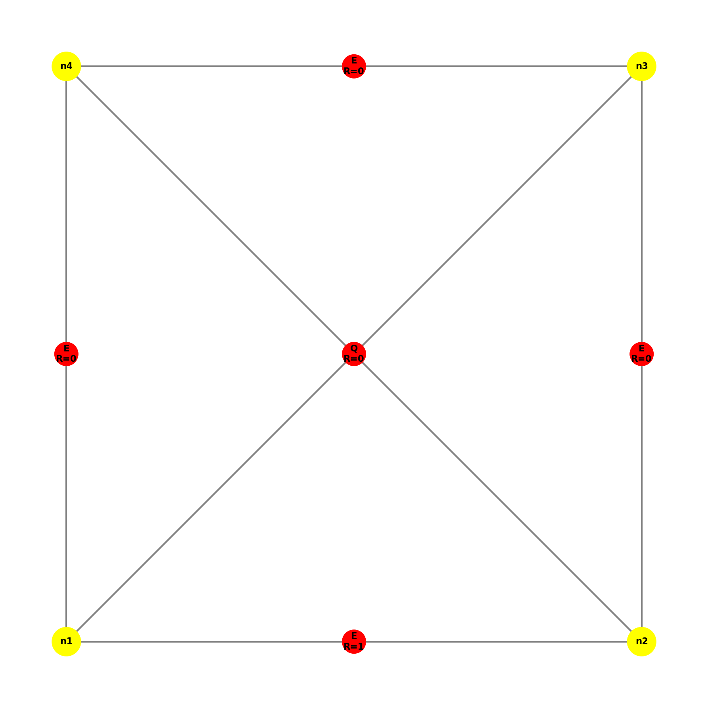
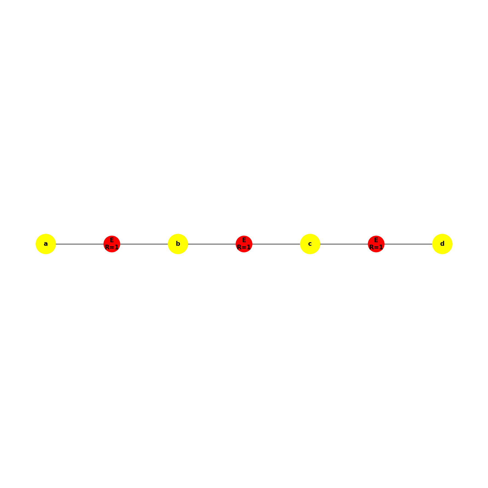
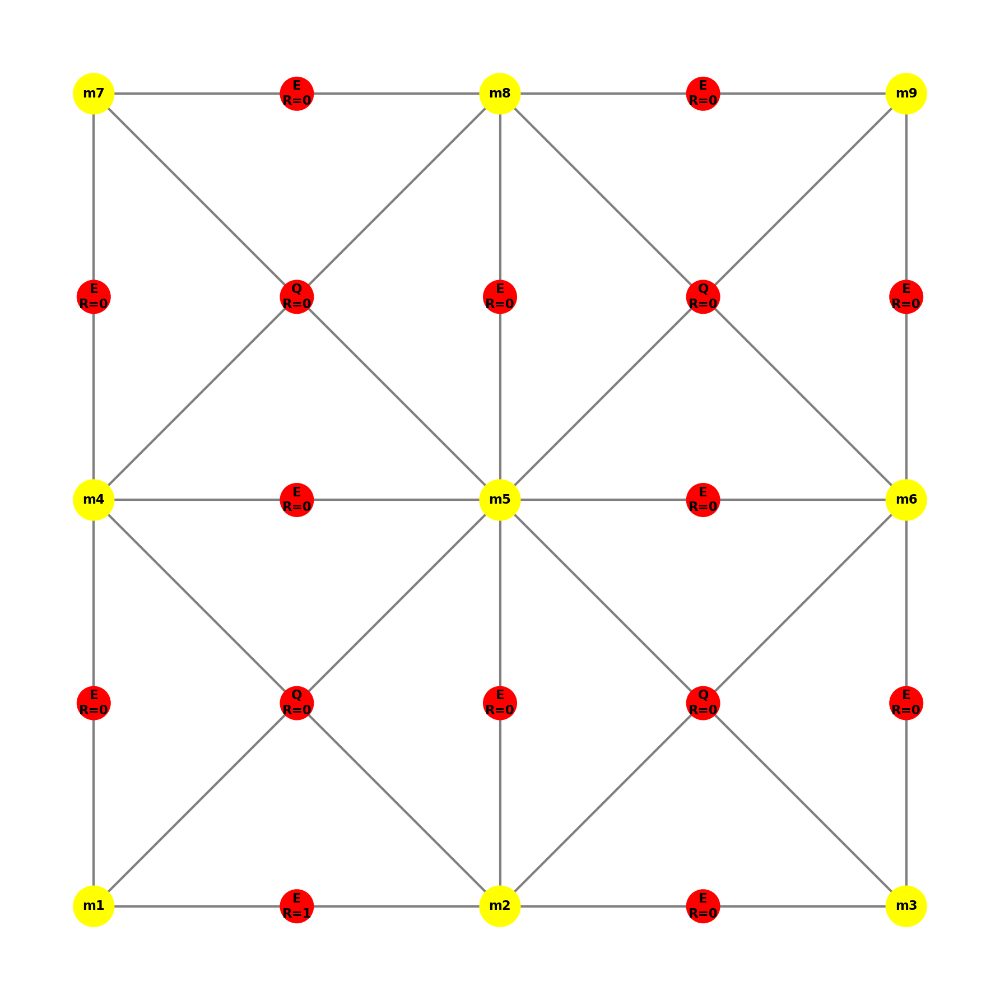
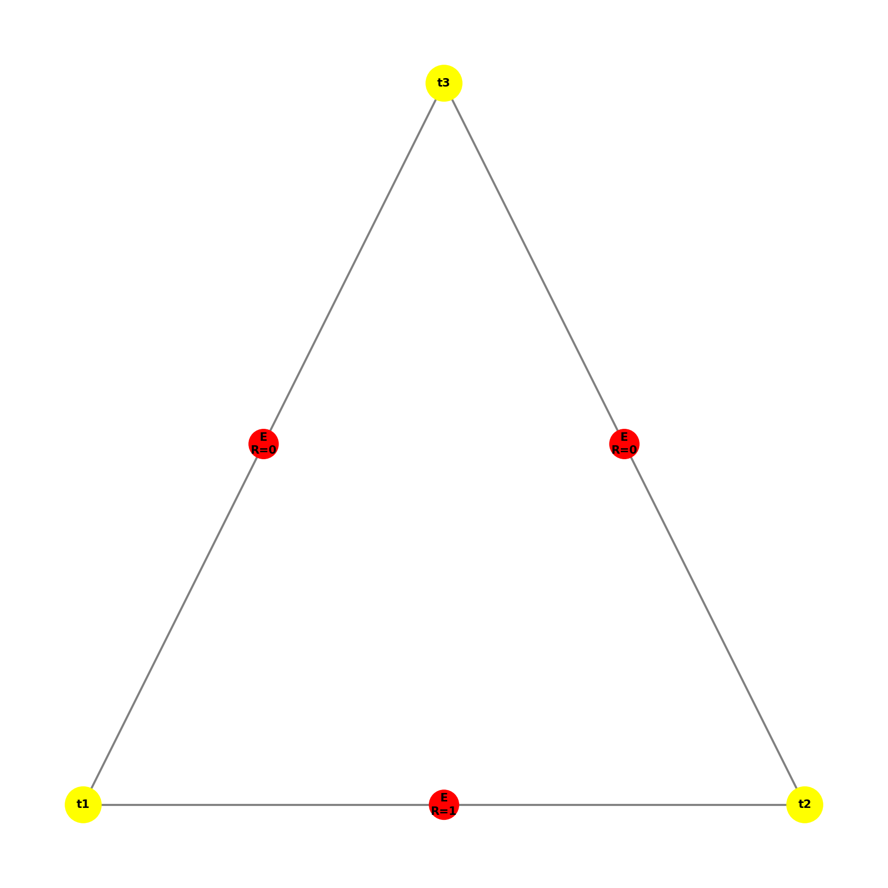
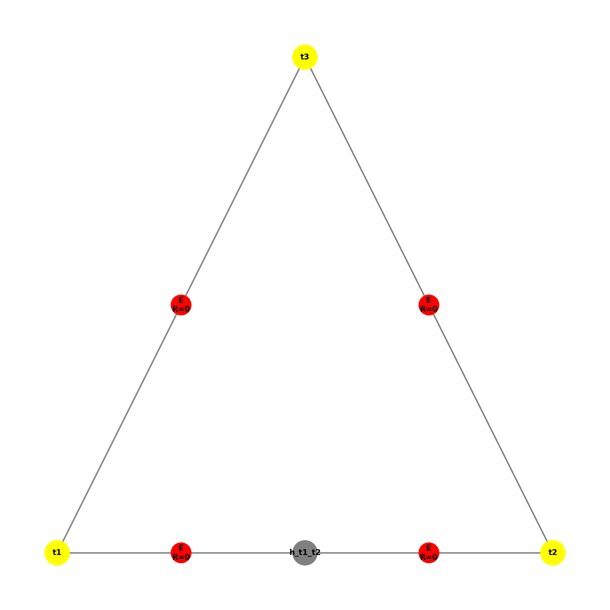

# Dokumentacja Produkcji P4

## Gramatyka Hipergrafów – Metoda PolyDPG

### Opis Produkcji P4

**Produkcja P4** łamie krawędzie brzegowe oznaczone do podziału (refinement). Jest to część procesu adaptacji siatki w metodzie PolyDPG.

---

## Lewa strona produkcji

Produkcja P4 wyszukuje krawędź o następujących właściwościach:

* **Etykieta**: `E` (krawędź)
* **B = 1**: krawędź brzegowa (boundary)
* **R = 1**: krawędź oznaczona do podziału (refinement)

```
     v1 ----E(R=1, B=1)---- v2
```

## Prawa strona produkcji

Po zastosowaniu produkcji P4:

1. Tworzony jest nowy **węzeł wiszący** (hanging node) w środku krawędzi.
2. Oryginalna krawędź jest zastępowana **dwoma nowymi krawędziami**.
3. Nowe krawędzie mają **R=0** (nie są już oznaczone do podziału).

```
     v1 ----E(R=0, B=1)---- h ----E(R=0, B=1)---- v2
```

gdzie `h` to węzeł wiszący o współrzędnych:

* `x = (v1.x + v2.x) / 2`
* `y = (v1.y + v2.y) / 2`

---

## Implementacja

### Sprawdzanie izomorfizmu z lewą stroną produkcji

Metoda `is_isomorphic_to_left_side()` sprawdza, czy podgraf jest izomorficzny z lewą stroną produkcji poprzez weryfikację:

```python
def is_isomorphic_to_left_side(self, subgraph: Graph) -> bool:
    nodes = subgraph.nodes
    edges = subgraph.hyperedges
    
    # Musi mieć dokładnie 2 węzły
    if len(nodes) != 2:
        return False
    
    # Musi mieć dokładnie 1 krawędź
    if len(edges) != 1:
        return False
    
    edge = edges[0]
    
    # Krawędź musi mieć etykietę 'E', być brzegowa (B=1) i oznaczona (R=1)
    if edge.hypertag != "E":
        return False
    if edge.B != 1:
        return False
    if edge.R != 1:
        return False
    
    # Krawędź musi łączyć oba węzły
    if set(edge.nodes) != set(nodes):
        return False
    
    return True
```

### Decyzja o miejscu zastosowania produkcji

Produkcja jest stosowana do **pierwszej znalezionej** krawędzi brzegowej oznaczonej do podziału. Metoda `find_match()` przeszukuje graf:

```python
def find_match(self, graph: Graph) -> Optional[HyperEdge]:
    for edge in graph.hyperedges:
        if edge.hypertag == "E" and edge.R == 1 and edge.B == 1:
            return edge
    return None
```

### Wyszukiwanie podgrafu izomorficznego w dużym grafie

Metoda `find_all_matches()` znajduje wszystkie pasujące krawędzie w grafie:

```python
def find_all_matches(self, graph: Graph) -> list:
    matches = []
    for edge in graph.hyperedges:
        if edge.hypertag == "E" and edge.R == 1 and edge.B == 1:
            matches.append(edge)
    return matches
```

Algorytm przeszukuje wszystkie hiperkrawędzie grafu i sprawdza:

1. Czy etykieta to `E`.
2. Czy R = 1 (oznaczona do podziału).
3. Czy B = 1 (krawędź brzegowa).

### Sprawdzanie poprawności wynikowego grafu

Po zastosowaniu produkcji sprawdzamy:

1. **Liczba węzłów**: powinna zwiększyć się o 1 (nowy węzeł wiszący).
2. **Liczba krawędzi E**: powinna zwiększyć się o 1 (1 -> 2).
3. **Atrybuty nowych krawędzi**: R=0, B=1.
4. **Pozycja węzła wiszącego**: środek oryginalnej krawędzi.
5. **Zachowanie innych krawędzi**: pozostałe krawędzie powinny być nienaruszone.

---

## Przeprowadzone Testy

### 1. Test podstawowej krawędzi brzegowej (test_p4_basic_boundary_edge)

**Opis**: Test P4 na prostej krawędzi brzegowej oznaczonej do podziału.

**Graf przed**:

* 2 węzły: v1(0,0), v2(4,0)
* 1 krawędź E z R=1, B=1

**Graf po**:

* 3 węzły (dodany węzeł wiszący w (2,0))
* 2 krawędzie E z R=0, B=1

**Wynik**: PASSED

|  **Przed**                                    | **Po**                                  |
|----------------------------------------------|------------------------------------------|
|  |  |

---

### 2. Test niemożności zastosowania do krawędzi współdzielonej (test_p4_cannot_apply_to_shared_edge)

**Opis**: P4 nie powinno być stosowane do krawędzi współdzielonych (B=0).

**Graf**:

* 2 węzły
* 1 krawędź E z R=1, B=0 (współdzielona, nie brzegowa)

**Wynik**: PASSED (produkcja nie została zastosowana)

---

### 3. Test niemożności zastosowania do nieoznaczonej krawędzi (test_p4_cannot_apply_to_unmarked_edge)

**Opis**: P4 nie powinno być stosowane do krawędzi nieoznaczonych do podziału.

**Graf**:

* 2 węzły
* 1 krawędź E z R=0, B=1 (brzegowa, ale nieoznaczona)

**Wynik**: PASSED (produkcja nie została zastosowana)

---

### 4. Test na kwadracie (test_p4_on_square)

**Opis**: Test P4 na kwadracie z jedną krawędzią brzegową oznaczoną do podziału.

**Graf przed**:

* 4 węzły (kwadrat)
* 4 krawędzie E (3 z R=0, 1 z R=1)
* 1 hiperkrawędź Q

**Graf po**:

* 5 węzłów
* 5 krawędzi E (wszystkie R=0)
* 1 hiperkrawędź Q (zachowana)

**Wynik**: PASSED

|  **Przed**                                    | **Po**                                  |
|----------------------------------------------|------------------------------------------|
|  |  |

---

### 5. Test na złożonej siatce (test_p4_on_complex_mesh)

**Opis**: Test P4 na siatce z wieloma elementami.

**Graf przed**:

* 6 węzłów
* Wiele krawędzi E (brzegowych i współdzielonych)
* 2 hiperkrawędzie Q

**Wynik**: PASSED (tylko krawędź brzegowa oznaczona została podzielona)

|  **Przed**                                    | **Po**                                  |
|----------------------------------------------|------------------------------------------|
|  |  |

---

### 6. Test zachowania innych krawędzi (test_p4_preserves_other_edges)

**Opis**: Sprawdzenie, czy P4 nie modyfikuje krawędzi, które nie są podzielone.

**Wynik**: PASSED

---

### 7. Test pozycji węzła wiszącego (test_p4_hanging_node_position)

**Opis**: Weryfikacja, czy węzeł wiszący jest tworzony we właściwym punkcie środkowym.

**Graf przed**:

* Węzły: p1(2,6), p2(10,14)
* Krawędź ukośna

**Graf po**:

* Węzeł wiszący w (6, 10) – punkt środkowy

**Wynik**: PASSED

|  **Przed**                                    | **Po**                                  |
|----------------------------------------------|------------------------------------------|
|  |  |

---

### 8. Test sprawdzania izomorfizmu (test_p4_isomorphism_check)

**Opis**: Test metody `is_isomorphic_to_left_side()`.

**Przypadki testowe**:

* Poprawna lewa strona (E, R=1, B=1)
* Niepoprawna lewa strona (R=0)
* Niepoprawna lewa strona (B=0)

**Wynik**: PASSED

---

### 9. Test brakującego węzła (test_p4_missing_node)

**Opis**: Test obsługi grafów z brakującymi węzłami.

**Wynik**: PASSED (produkcja nie została zastosowana)

---

### 10. Test złej etykiety krawędzi (test_p4_wrong_edge_label)

**Opis**: P4 nie powinno być stosowane do krawędzi z etykietą inną niż E.

**Wynik**: PASSED

---

### 11. Test znajdowania wielu dopasowań (test_p4_find_all_matches)

**Opis**: Test metody `find_all_matches()` dla wielu krawędzi brzegowych oznaczonych do podziału.

**Graf przed**:

* 4 węzły w linii
* 3 krawędzie E z R=1, B=1

**Po 3 zastosowaniach P4**:

* 7 węzłów
* 6 krawędzi E z R=0

**Wynik**: PASSED

|  **Przed**                                    | **Po**                                  |
|----------------------------------------------|------------------------------------------|
|  |  |

---

### 12. Test osadzenia w większym grafie (test_p4_embedded_in_larger_graph)

**Opis**: Test P4, gdy pasujący podgraf jest częścią większego grafu.

**Graf przed**:

* Siatka 3x3 (9 węzłów)
* Wiele krawędzi (brzegowych i wewnętrznych)
* 4 hiperkrawędzie Q

**Graf po**:

* 10 węzłów
* Wszystkie hiperkrawędzie Q zachowane
* Tylko jedna krawędź brzegowa podzielona

**Wynik**: PASSED

|  **Przed**                                    | **Po**                                  |
|----------------------------------------------|------------------------------------------|
|  |  |

---

### 13. Test trójkąta (test_p4_triangle_boundary)

**Opis**: Test P4 na trójkącie z krawędziami brzegowymi.

**Graf przed**:

* 3 węzły (trójkąt)
* 3 krawędzie E (1 z R=1)

**Graf po**:

* 4 węzły
* 4 krawędzie E (wszystkie R=0)

**Wynik**: PASSED

|  **Przed**                                    | **Po**                                  |
|----------------------------------------------|------------------------------------------|
|  |  |

---

### 14. Test brakującej krawędzi (test_p4_missing_edge)

**Opis**: Test, że P4 nie może być zastosowane, gdy są 2 węzły, ale brak krawędzi łączącej.

**Graf**:

* 2 węzły: v1(0,0), v2(4,0)
* 0 krawędzi (brak krawędzi)

**Wynik**: PASSED (produkcja nie została zastosowana, graf pozostał niezmieniony)

---

### 15. Test zmiany etykiet wierzchołków (test_p4_vertex_label_change)

**Opis**: Weryfikacja, że różne etykiety wierzchołków nie wpływają na mechanizm produkcji.

**Przypadki testowe**:

* Standardowe etykiety: ("a", "b")
* Etykiety z podkreśleniem: ("node_1", "node_2")
* Krótkie etykiety: ("x", "y")
* Etykiety numeryczne: ("123", "456")
* Etykiety Unicode: ("α", "β")
* Długie etykiety: ("very_long_label_name_1", "very_long_label_name_2")

**Wynik**: PASSED (produkcja działa poprawnie dla wszystkich typów etykiet)

---

### 16. Test różnych współrzędnych wierzchołków (test_p4_wrong_vertex_coordinates)

**Opis**: Weryfikacja poprawności obliczeń pozycji węzła wiszącego dla różnych konfiguracji współrzędnych.

**Przypadki testowe**:
| Konfiguracja | v1 | v2 | Oczekiwany środek |
|--------------|-----|-----|-------------------|
| Pozioma | (0,0) | (4,0) | (2.0, 0.0) |
| Pionowa | (0,0) | (0,4) | (0.0, 2.0) |
| Ukośna | (0,0) | (4,4) | (2.0, 2.0) |
| Przez początek | (-2,-2) | (2,2) | (0.0, 0.0) |
| Zmiennoprzecinkowe | (1.5,2.5) | (3.5,4.5) | (2.5, 3.5) |
| Duże wartości | (100,200) | (300,400) | (200.0, 300.0) |
| Ujemne wartości | (-100,-200) | (-300,-400) | (-200.0, -300.0) |

**Wynik**: PASSED (wszystkie obliczenia środka są poprawne)

---

### 17. Test usunięcia krawędzi z poprawnego grafu (test_p4_remove_random_edge_from_valid_graph)

**Opis**: Test, że usunięcie krawędzi oznaczonej do podziału z poprawnego grafu uniemożliwia zastosowanie produkcji.

**Graf**:

* 4 węzły (kwadrat)
* 3 krawędzie E (bez krawędzi oznaczonej R=1, B=1)

**Wynik**: PASSED (produkcja nie została zastosowana)

---

### 18. Test poprawności wizualizacji (test_p4_visualization_correctness)

**Opis**: Automatyczna weryfikacja poprawności elementów grafu po zastosowaniu produkcji.

**Sprawdzane elementy**:

1. Wszystkie wierzchołki istnieją (3 węzły).
2. Wszystkie krawędzie istnieją (2 krawędzie E).
3. Wierzchołki mają poprawne współrzędne: (0,0), (4,0), (2,0).
4. Wszystkie wierzchołki mają etykiety.
5. Wszystkie węzły są połączone krawędziami.
6. Plik wizualizacji został utworzony.

**Wynik**: PASSED

| **Wizualizacja** |
|------------------|
|  |

---

### 19. Test kompletnej weryfikacji prawej strony (test_p4_complete_right_side_verification)

**Opis**: Kompleksowy test weryfikujący wszystkie aspekty prawej strony produkcji.

**Graf przed**:

* 2 węzły: v1(0,0), v2(6,0)
* 1 krawędź E z R=1, B=1

**Weryfikacja wierzchołków**:

* 3 węzły łącznie (2 oryginalne + 1 wiszący).
* Węzeł wiszący w pozycji (3.0, 0.0).
* Węzeł wiszący ma etykietę.

**Weryfikacja krawędzi**:

* 2 krawędzie E.
* Wszystkie krawędzie mają B=1.
* Wszystkie krawędzie mają R=0.
* Wszystkie krawędzie mają etykietę "E".
* Każda krawędź łączy dokładnie 2 węzły.

**Weryfikacja połączeń**:

* Krawędź od v1(0,0) do h(3,0).
* Krawędź od h(3,0) do v2(6,0).

**Wynik**: PASSED

---

## Podsumowanie Testów

| Numer | Nazwa testu | Status |
| --- | --- | --- |
| 1 | P4 BASIC BOUNDARY EDGE | PASSED |
| 2 | P4 CANNOT APPLY TO SHARED EDGE | PASSED |
| 3 | P4 CANNOT APPLY TO UNMARKED EDGE | PASSED |
| 4 | P4 ON SQUARE | PASSED |
| 5 | P4 ON COMPLEX MESH | PASSED |
| 6 | P4 PRESERVES OTHER EDGES | PASSED |
| 7 | P4 HANGING NODE POSITION | PASSED |
| 8 | P4 ISOMORPHISM CHECK | PASSED |
| 9 | P4 MISSING NODE | PASSED |
| 10 | P4 WRONG EDGE LABEL | PASSED |
| 11 | P4 FIND ALL MATCHES | PASSED |
| 12 | P4 EMBEDDED IN LARGER GRAPH | PASSED |
| 13 | P4 TRIANGLE BOUNDARY | PASSED |
| 14 | P4 MISSING EDGE | PASSED |
| 15 | P4 VERTEX LABEL CHANGE | PASSED |
| 16 | P4 WRONG VERTEX COORDINATES | PASSED |
| 17 | P4 REMOVE RANDOM EDGE FROM VALID GRAPH | PASSED |
| 18 | P4 VISUALIZATION CORRECTNESS | PASSED |
| 19 | P4 COMPLETE RIGHT SIDE VERIFICATION | PASSED |

**Wynik końcowy: 19/19 testów zaliczonych**

---

## Pokrycie wymagań testowych

### 1. Czy produkcja dobrze sprawdza izomorfizm z lewą stroną (czy da się ją wykonać)?

| Wymaganie | Status | Testy |
| --- | --- | --- |
| Czy da się wykonać produkcję do grafu izomorficznego z lewą stroną | ✅ | #1, #8 |
| Usunięcie losowego wierzchołka nie psuje mechanizmu | ✅ | #9 |
| Usunięcie losowej krawędzi nie psuje mechanizmu | ✅ | #14, #17 |
| Zmiana etykiety wierzchołka nie psuje mechanizmu | ✅ | #15 |
| Osadzenie w większym grafie nie psuje mechanizmu | ✅ | #12 |

### 2. Czy produkcja dobrze się wykonała?

| Wymaganie | Status | Testy |
| --- | --- | --- |
| Produkcja nie uszkadza większego grafu | ✅ | #5, #12 |
| Produkcja dobrze transformuje osadzenie | ✅ | #12 |
| Graf prawej strony jest poprawny (wierzchołki, krawędzie, etykiety) | ✅ | #1, #19 |
| Współrzędne nowych wierzchołków są poprawne | ✅ | #7, #16 |

### 3. Czy graf po zastosowaniu produkcji dobrze się rysuje?

| Wymaganie | Status | Testy |
| --- | --- | --- |
| Czy są wszystkie wierzchołki i krawędzie | ✅ | #18 |
| Czy wierzchołki są w poprawnych współrzędnych | ✅ | #18 |
| Czy są narysowane etykiety wierzchołków | ✅ | #18 |

### 4. Czy zostały przygotowane różne grafy do testowania?

| Wymaganie | Status | Testy |
| --- | --- | --- |
| Graf izomorficzny z lewą stroną | ✅ | #1 |
| Graf zawierający lewą stronę jako podgraf | ✅ | #4, #5 |
| Graf niepoprawny (brak wierzchołka) | ✅ | #9 |
| Graf niepoprawny (brak krawędzi) | ✅ | #14 |
| Graf niepoprawny (zła etykieta) | ✅ | #10 |
| Graf z różnymi współrzędnymi | ✅ | #16 |

### 5. Czy wynik uzyskany po zastosowaniu produkcji został dobrze sprawdzony?

| Wymaganie | Status | Testy |
| --- | --- | --- |
| Produkcja wykonała się na poprawnym, nie na niepoprawnym grafie | ✅ | #2, #3, #9, #10, #14 |
| Produkcja nie uszkadza większego grafu | ✅ | #5, #12 |
| Produkcja dobrze transformuje osadzenie | ✅ | #6, #12 |
| Graf prawej strony jest poprawny | ✅ | #1, #19 |
| Współrzędne nowych wierzchołków są poprawne | ✅ | #7, #16, #19 |

---

## Uruchomienie testów

```bash
# Instalacja zależności
pip install -r requirements.txt

# Uruchomienie testów P4
python tests/test_p4.py

# Uruchomienie za pomocą pytest
pytest tests/test_p4.py -v
```

---

## Struktura plików

```
graph_model.py              # Model grafu i hiperkrawędzi
production_base.py          # Klasa bazowa produkcji
productions/
    p4.py                   # Implementacja produkcji P4
tests/
    test_p4.py              # Testy jednostkowe P4
visualization.py            # Wizualizacja grafów
visualizations/             # Folder z wizualizacjami
    p4_visualisations/      # Wizualizacje testów P4
        test_p4_*.png
docs/
    dokumentacja_p4.md      # Ten plik dokumentacji
```

---
