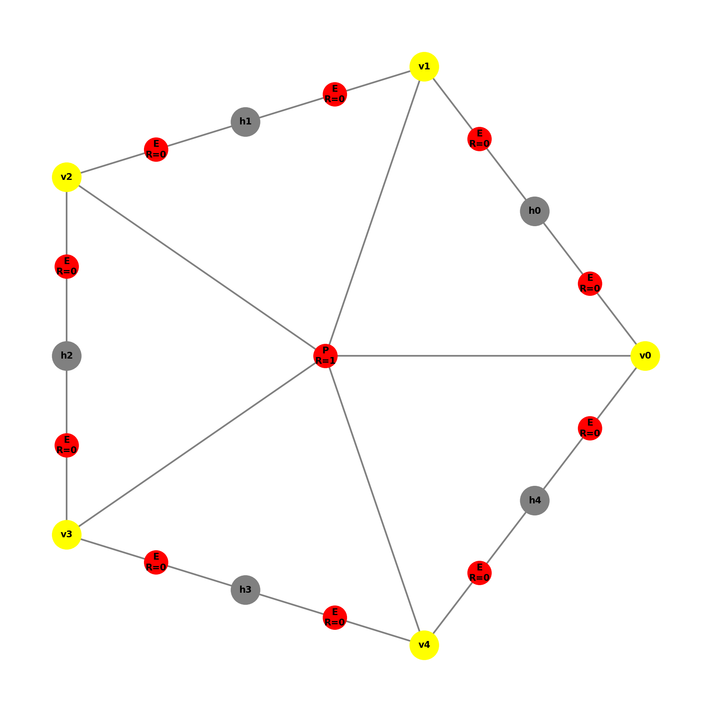
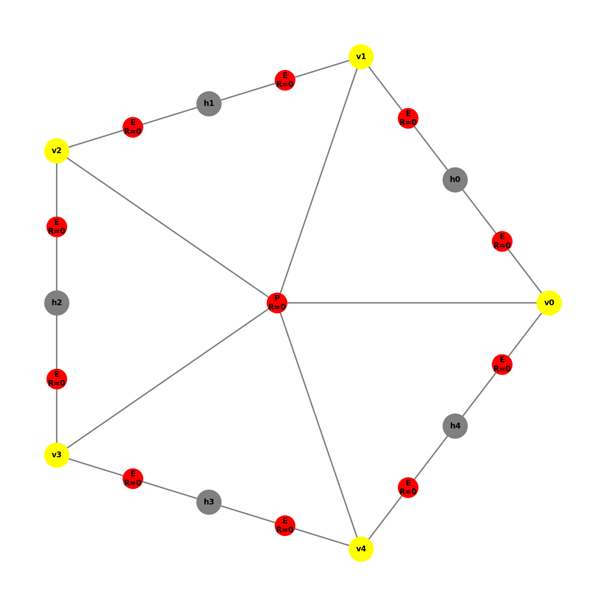
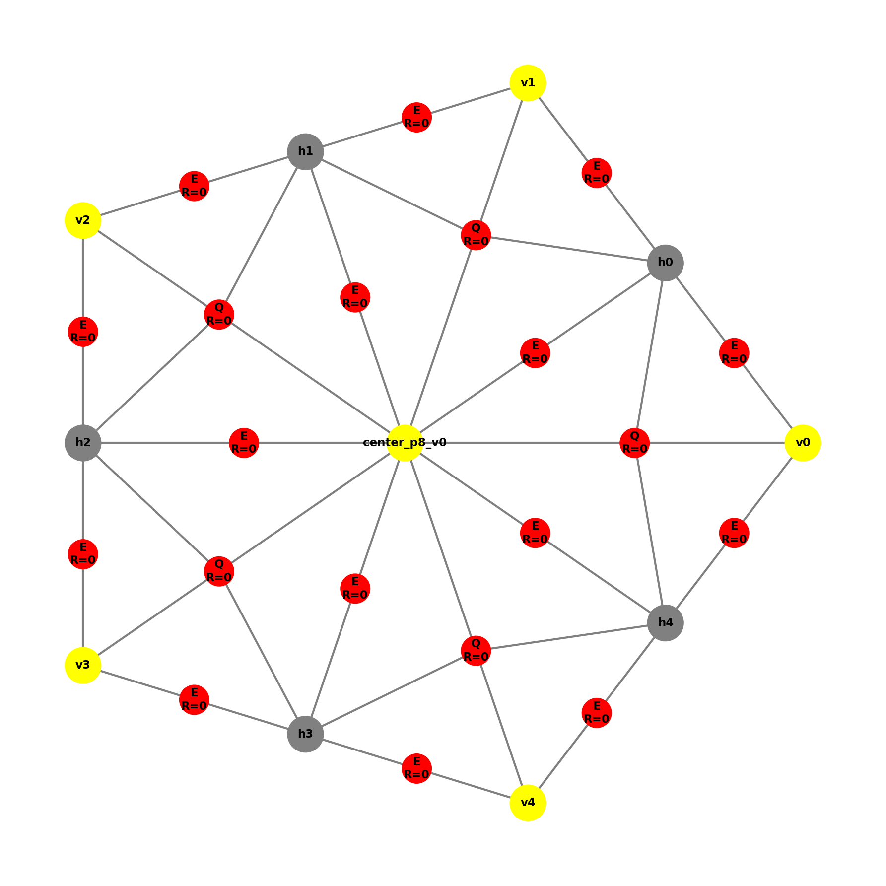
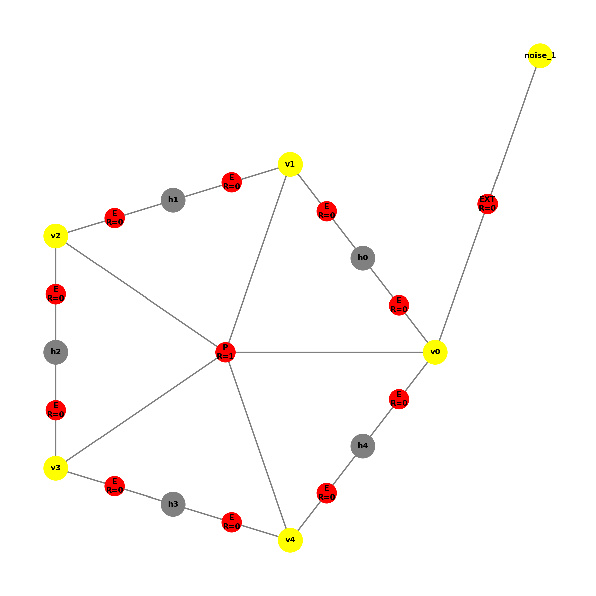
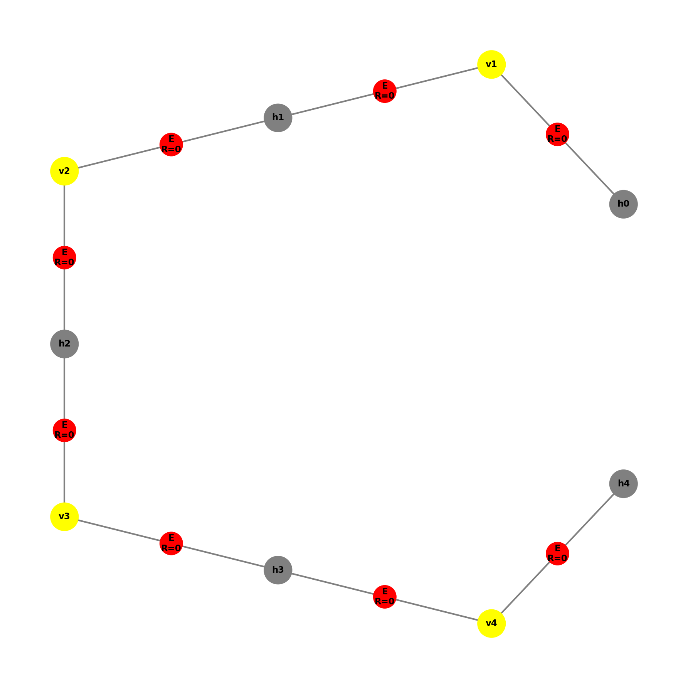
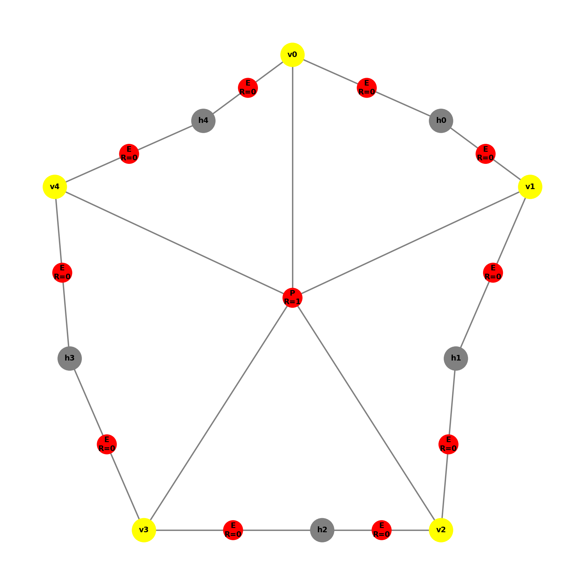
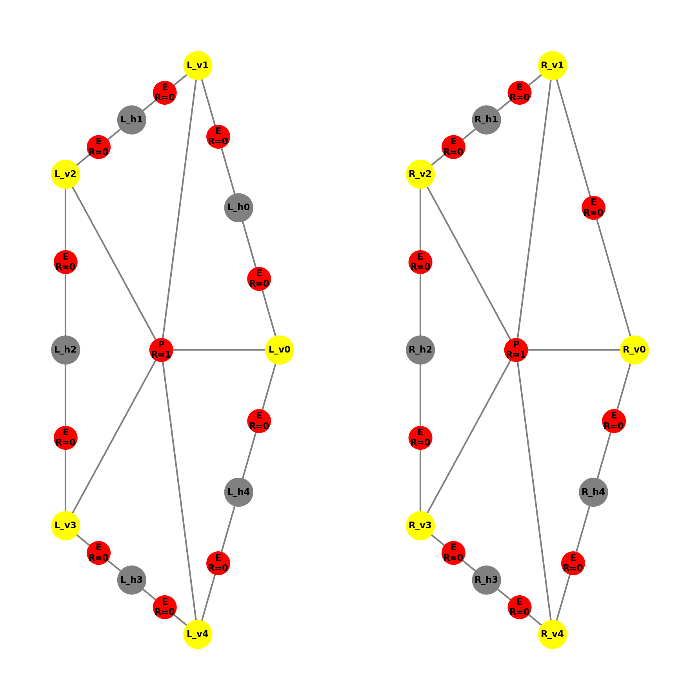
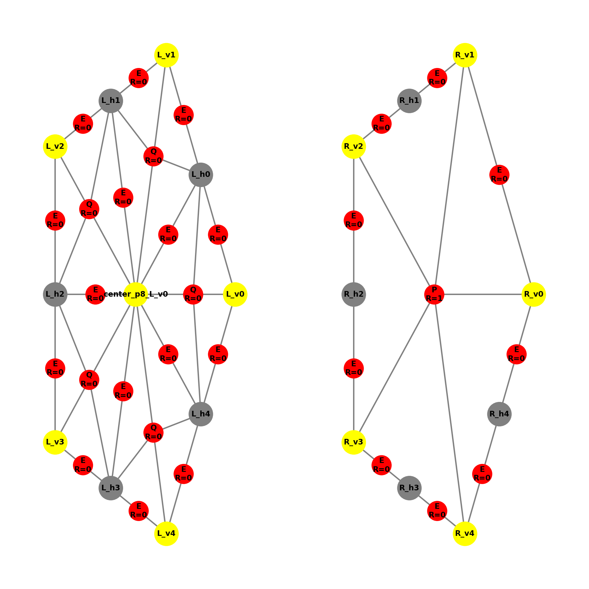

# Gramatyka Hipergrafów – Metoda PolyDPG - Dokumentacja Produkcji P4 i P8

Patryk Klatka & Antoni Wójcik

## Część 1: Produkcja P4

## Opis Produkcji P4

**Produkcja P4** łamie krawędzie brzegowe oznaczone do podziału (refinement). Jest to część procesu adaptacji siatki w metodzie PolyDPG.

---

## Lewa strona produkcji

Produkcja P4 wyszukuje krawędź o następujących właściwościach:

* **Etykieta**: `E` (krawędź)
* **B = 1**: krawędź brzegowa (boundary)
* **R = 1**: krawędź oznaczona do podziału (refinement)

```
     v1 ----E(R=1, B=1)---- v2
```

## Prawa strona produkcji

Po zastosowaniu produkcji P4:

1. Tworzony jest nowy **węzeł wiszący** (hanging node) w środku krawędzi.
2. Oryginalna krawędź jest zastępowana **dwoma nowymi krawędziami**.
3. Nowe krawędzie mają **R=0** (nie są już oznaczone do podziału).

```
     v1 ----E(R=0, B=1)---- h ----E(R=0, B=1)---- v2
```

gdzie `h` to węzeł wiszący o współrzędnych:

* `x = (v1.x + v2.x) / 2`
* `y = (v1.y + v2.y) / 2`

---

## Implementacja

### Sprawdzanie izomorfizmu z lewą stroną produkcji

Metoda `is_isomorphic_to_left_side()` sprawdza, czy podgraf jest izomorficzny z lewą stroną produkcji poprzez weryfikację:

```python
def is_isomorphic_to_left_side(self, subgraph: Graph) -> bool:
    nodes = subgraph.nodes
    edges = subgraph.hyperedges
    
    # Musi mieć dokładnie 2 węzły
    if len(nodes) != 2:
        return False
    
    # Musi mieć dokładnie 1 krawędź
    if len(edges) != 1:
        return False
    
    edge = edges[0]
    
    # Krawędź musi mieć etykietę 'E', być brzegowa (B=1) i oznaczona (R=1)
    if edge.hypertag != "E":
        return False
    if edge.B != 1:
        return False
    if edge.R != 1:
        return False
    
    # Krawędź musi łączyć oba węzły
    if set(edge.nodes) != set(nodes):
        return False
    
    return True
```

**Warunki izomorfizmu:**
1. Podgraf musi mieć dokładnie 2 węzły.
2. Podgraf musi mieć dokładnie 1 krawędź.
3. Krawędź musi mieć etykietę `E`.
4. Krawędź musi być brzegowa (B=1).
5. Krawędź musi być oznaczona do podziału (R=1).
6. Krawędź musi łączyć oba węzły podgrafu.

### Decyzja o miejscu zastosowania produkcji

Produkcja jest stosowana do **pierwszej znalezionej** krawędzi brzegowej oznaczonej do podziału. Metoda `find_match()` przeszukuje graf:

```python
def find_match(self, graph: Graph) -> Optional[HyperEdge]:
    for edge in graph.hyperedges:
        if edge.hypertag == "E" and edge.R == 1 and edge.B == 1:
            return edge
    return None
```

### Wyszukiwanie podgrafu izomorficznego w dużym grafie

Metoda `find_all_matches()` znajduje wszystkie pasujące krawędzie w grafie:

```python
def find_all_matches(self, graph: Graph) -> list:
    matches = []
    for edge in graph.hyperedges:
        if edge.hypertag == "E" and edge.R == 1 and edge.B == 1:
            matches.append(edge)
    return matches
```

Algorytm przeszukuje wszystkie hiperkrawędzie grafu i sprawdza:

1. Czy etykieta to `E`.
2. Czy R = 1 (oznaczona do podziału).
3. Czy B = 1 (krawędź brzegowa).

### Sprawdzanie poprawności wynikowego grafu

Po zastosowaniu produkcji sprawdzamy:

1. **Liczba węzłów**: powinna zwiększyć się o 1 (nowy węzeł wiszący).
2. **Liczba krawędzi E**: powinna zwiększyć się o 1 (1 -> 2).
3. **Atrybuty nowych krawędzi**: R=0, B=1.
4. **Pozycja węzła wiszącego**: środek oryginalnej krawędzi.
5. **Zachowanie innych krawędzi**: pozostałe krawędzie powinny być nienaruszone.

---

## Przeprowadzone Testy P4

### 1. Test podstawowej krawędzi brzegowej (test_p4_basic_boundary_edge)

**Opis**: Test P4 na prostej krawędzi brzegowej oznaczonej do podziału.

**Graf przed**:

* 2 węzły: v1(0,0), v2(4,0)
* 1 krawędź E z R=1, B=1

**Graf po**:

* 3 węzły (dodany węzeł wiszący w (2,0))
* 2 krawędzie E z R=0, B=1

**Wynik**: PASSED

|  **Przed**                                    | **Po**                                  |
|----------------------------------------------|------------------------------------------|
|  |  |

---

### 2. Test niemożności zastosowania do krawędzi współdzielonej (test_p4_cannot_apply_to_shared_edge)

**Opis**: P4 nie powinno być stosowane do krawędzi współdzielonych (B=0).

**Graf**:

* 2 węzły
* 1 krawędź E z R=1, B=0 (współdzielona, nie brzegowa)

**Wynik**: PASSED (produkcja nie została zastosowana)

---

### 3. Test niemożności zastosowania do nieoznaczonej krawędzi (test_p4_cannot_apply_to_unmarked_edge)

**Opis**: P4 nie powinno być stosowane do krawędzi nieoznaczonych do podziału.

**Graf**:

* 2 węzły
* 1 krawędź E z R=0, B=1 (brzegowa, ale nieoznaczona)

**Wynik**: PASSED (produkcja nie została zastosowana)

---

### 4. Test na kwadracie (test_p4_on_square)

**Opis**: Test P4 na kwadracie z jedną krawędzią brzegową oznaczoną do podziału.

**Graf przed**:

* 4 węzły (kwadrat)
* 4 krawędzie E (3 z R=0, 1 z R=1)
* 1 hiperkrawędź Q

**Graf po**:

* 5 węzłów
* 5 krawędzi E (wszystkie R=0)
* 1 hiperkrawędź Q (zachowana)

**Wynik**: PASSED

|  **Przed**                                    | **Po**                                  |
|----------------------------------------------|------------------------------------------|
|  |  |

---

### 5. Test na złożonej siatce (test_p4_on_complex_mesh)

**Opis**: Test P4 na siatce z wieloma elementami.

**Graf przed**:

* 6 węzłów
* Wiele krawędzi E (brzegowych i współdzielonych)
* 2 hiperkrawędzie Q

**Wynik**: PASSED (tylko krawędź brzegowa oznaczona została podzielona)

|  **Przed**                                    | **Po**                                  |
|----------------------------------------------|------------------------------------------|
|  |  |

---

### 6. Test zachowania innych krawędzi (test_p4_preserves_other_edges)

**Opis**: Sprawdzenie, czy P4 nie modyfikuje krawędzi, które nie są podzielone.

**Wynik**: PASSED

---

### 7. Test pozycji węzła wiszącego (test_p4_hanging_node_position)

**Opis**: Weryfikacja, czy węzeł wiszący jest tworzony we właściwym punkcie środkowym.

**Graf przed**:

* Węzły: p1(2,6), p2(10,14)
* Krawędź ukośna

**Graf po**:

* Węzeł wiszący w (6, 10) – punkt środkowy

**Wynik**: PASSED

|  **Przed**                                    | **Po**                                  |
|----------------------------------------------|------------------------------------------|
|  |  |

---

### 8. Test sprawdzania izomorfizmu (test_p4_isomorphism_check)

**Opis**: Test metody `is_isomorphic_to_left_side()`.

**Przypadki testowe**:

* Poprawna lewa strona (E, R=1, B=1)
* Niepoprawna lewa strona (R=0)
* Niepoprawna lewa strona (B=0)

**Wynik**: PASSED

---

### 9. Test brakującego węzła (test_p4_missing_node)

**Opis**: Test obsługi grafów z brakującymi węzłami.

**Wynik**: PASSED (produkcja nie została zastosowana)

---

### 10. Test złej etykiety krawędzi (test_p4_wrong_edge_label)

**Opis**: P4 nie powinno być stosowane do krawędzi z etykietą inną niż E.

**Wynik**: PASSED

---

### 11. Test znajdowania wielu dopasowań (test_p4_find_all_matches)

**Opis**: Test metody `find_all_matches()` dla wielu krawędzi brzegowych oznaczonych do podziału.

**Graf przed**:

* 4 węzły w linii
* 3 krawędzie E z R=1, B=1

**Po 3 zastosowaniach P4**:

* 7 węzłów
* 6 krawędzi E z R=0

**Wynik**: PASSED

|  **Przed**                                    | **Po**                                  |
|----------------------------------------------|------------------------------------------|
|  |  |

---

### 12. Test osadzenia w większym grafie (test_p4_embedded_in_larger_graph)

**Opis**: Test P4, gdy pasujący podgraf jest częścią większego grafu.

**Graf przed**:

* Siatka 3x3 (9 węzłów)
* Wiele krawędzi (brzegowych i wewnętrznych)
* 4 hiperkrawędzie Q

**Graf po**:

* 10 węzłów
* Wszystkie hiperkrawędzie Q zachowane
* Tylko jedna krawędź brzegowa podzielona

**Wynik**: PASSED

|  **Przed**                                    | **Po**                                  |
|----------------------------------------------|------------------------------------------|
|  |  |

---

### 13. Test trójkąta (test_p4_triangle_boundary)

**Opis**: Test P4 na trójkącie z krawędziami brzegowymi.

**Graf przed**:

* 3 węzły (trójkąt)
* 3 krawędzie E (1 z R=1)

**Graf po**:

* 4 węzły
* 4 krawędzie E (wszystkie R=0)

**Wynik**: PASSED

|  **Przed**                                    | **Po**                                  |
|----------------------------------------------|------------------------------------------|
|  |  |

---

### 14. Test brakującej krawędzi (test_p4_missing_edge)

**Opis**: Test, że P4 nie może być zastosowane, gdy są 2 węzły, ale brak krawędzi łączącej.

**Graf**:

* 2 węzły: v1(0,0), v2(4,0)
* 0 krawędzi (brak krawędzi)

**Wynik**: PASSED (produkcja nie została zastosowana, graf pozostał niezmieniony)

---

### 15. Test zmiany etykiet wierzchołków (test_p4_vertex_label_change)

**Opis**: Weryfikacja, że różne etykiety wierzchołków nie wpływają na mechanizm produkcji.

**Przypadki testowe**:

* Standardowe etykiety: ("a", "b")
* Etykiety z podkreśleniem: ("node_1", "node_2")
* Krótkie etykiety: ("x", "y")
* Etykiety numeryczne: ("123", "456")
* Etykiety Unicode: ("α", "β")
* Długie etykiety: ("very_long_label_name_1", "very_long_label_name_2")

**Wynik**: PASSED (produkcja działa poprawnie dla wszystkich typów etykiet)

---

### 16. Test różnych współrzędnych wierzchołków (test_p4_wrong_vertex_coordinates)

**Opis**: Weryfikacja poprawności obliczeń pozycji węzła wiszącego dla różnych konfiguracji współrzędnych.

**Przypadki testowe**:
| Konfiguracja | v1 | v2 | Oczekiwany środek |
|--------------|-----|-----|-------------------|
| Pozioma | (0,0) | (4,0) | (2.0, 0.0) |
| Pionowa | (0,0) | (0,4) | (0.0, 2.0) |
| Ukośna | (0,0) | (4,4) | (2.0, 2.0) |
| Przez początek | (-2,-2) | (2,2) | (0.0, 0.0) |
| Zmiennoprzecinkowe | (1.5,2.5) | (3.5,4.5) | (2.5, 3.5) |
| Duże wartości | (100,200) | (300,400) | (200.0, 300.0) |
| Ujemne wartości | (-100,-200) | (-300,-400) | (-200.0, -300.0) |

**Wynik**: PASSED (wszystkie obliczenia środka są poprawne)

---

### 17. Test usunięcia krawędzi z poprawnego grafu (test_p4_remove_random_edge_from_valid_graph)

**Opis**: Test, że usunięcie krawędzi oznaczonej do podziału z poprawnego grafu uniemożliwia zastosowanie produkcji.

**Graf**:

* 4 węzły (kwadrat)
* 3 krawędzie E (bez krawędzi oznaczonej R=1, B=1)

**Wynik**: PASSED (produkcja nie została zastosowana)

---

### 18. Test poprawności wizualizacji (test_p4_visualization_correctness)

**Opis**: Automatyczna weryfikacja poprawności elementów grafu po zastosowaniu produkcji.

**Sprawdzane elementy**:

1. Wszystkie wierzchołki istnieją (3 węzły).
2. Wszystkie krawędzie istnieją (2 krawędzie E).
3. Wierzchołki mają poprawne współrzędne: (0,0), (4,0), (2,0).
4. Wszystkie wierzchołki mają etykiety.
5. Wszystkie węzły są połączone krawędziami.
6. Plik wizualizacji został utworzony.

**Wynik**: PASSED

| **Wizualizacja** |
|------------------|
|  |

---

### 19. Test kompletnej weryfikacji prawej strony (test_p4_complete_right_side_verification)

**Opis**: Kompleksowy test weryfikujący wszystkie aspekty prawej strony produkcji.

**Graf przed**:

* 2 węzły: v1(0,0), v2(6,0)
* 1 krawędź E z R=1, B=1

**Weryfikacja wierzchołków**:

* 3 węzły łącznie (2 oryginalne + 1 wiszący).
* Węzeł wiszący w pozycji (3.0, 0.0).
* Węzeł wiszący ma etykietę.

**Weryfikacja krawędzi**:

* 2 krawędzie E.
* Wszystkie krawędzie mają B=1.
* Wszystkie krawędzie mają R=0.
* Wszystkie krawędzie mają etykietę "E".
* Każda krawędź łączy dokładnie 2 węzły.

**Weryfikacja połączeń**:

* Krawędź od v1(0,0) do h(3,0).
* Krawędź od h(3,0) do v2(6,0).

**Wynik**: PASSED

---

## Podsumowanie Testów P4

| Numer | Nazwa testu | Status |
| --- | --- | --- |
| 1 | P4 BASIC BOUNDARY EDGE | PASSED |
| 2 | P4 CANNOT APPLY TO SHARED EDGE | PASSED |
| 3 | P4 CANNOT APPLY TO UNMARKED EDGE | PASSED |
| 4 | P4 ON SQUARE | PASSED |
| 5 | P4 ON COMPLEX MESH | PASSED |
| 6 | P4 PRESERVES OTHER EDGES | PASSED |
| 7 | P4 HANGING NODE POSITION | PASSED |
| 8 | P4 ISOMORPHISM CHECK | PASSED |
| 9 | P4 MISSING NODE | PASSED |
| 10 | P4 WRONG EDGE LABEL | PASSED |
| 11 | P4 FIND ALL MATCHES | PASSED |
| 12 | P4 EMBEDDED IN LARGER GRAPH | PASSED |
| 13 | P4 TRIANGLE BOUNDARY | PASSED |
| 14 | P4 MISSING EDGE | PASSED |
| 15 | P4 VERTEX LABEL CHANGE | PASSED |
| 16 | P4 WRONG VERTEX COORDINATES | PASSED |
| 17 | P4 REMOVE RANDOM EDGE FROM VALID GRAPH | PASSED |
| 18 | P4 VISUALIZATION CORRECTNESS | PASSED |
| 19 | P4 COMPLETE RIGHT SIDE VERIFICATION | PASSED |

**Wynik końcowy P4: 19/19 testów zaliczonych**

---

## Pokrycie wymagań testowych P4

### 1. Czy produkcja dobrze sprawdza izomorfizm z lewą stroną (czy da się ją wykonać)?

| Wymaganie | Status | Testy |
| --- | --- | --- |
| Czy da się wykonać produkcję do grafu izomorficznego z lewą stroną | ✅ | #1, #8 |
| Usunięcie losowego wierzchołka nie psuje mechanizmu | ✅ | #9 |
| Usunięcie losowej krawędzi nie psuje mechanizmu | ✅ | #14, #17 |
| Zmiana etykiety wierzchołka nie psuje mechanizmu | ✅ | #15 |
| Osadzenie w większym grafie nie psuje mechanizmu | ✅ | #12 |

### 2. Czy produkcja dobrze się wykonała?

| Wymaganie | Status | Testy |
| --- | --- | --- |
| Produkcja nie uszkadza większego grafu | ✅ | #5, #12 |
| Produkcja dobrze transformuje osadzenie | ✅ | #12 |
| Graf prawej strony jest poprawny (wierzchołki, krawędzie, etykiety) | ✅ | #1, #19 |
| Współrzędne nowych wierzchołków są poprawne | ✅ | #7, #16 |

### 3. Czy graf po zastosowaniu produkcji dobrze się rysuje?

| Wymaganie | Status | Testy |
| --- | --- | --- |
| Czy są wszystkie wierzchołki i krawędzie | ✅ | #18 |
| Czy wierzchołki są w poprawnych współrzędnych | ✅ | #18 |
| Czy są narysowane etykiety wierzchołków | ✅ | #18 |

### 4. Czy zostały przygotowane różne grafy do testowania?

| Wymaganie | Status | Testy |
| --- | --- | --- |
| Graf izomorficzny z lewą stroną | ✅ | #1 |
| Graf zawierający lewą stronę jako podgraf | ✅ | #4, #5 |
| Graf niepoprawny (brak wierzchołka) | ✅ | #9 |
| Graf niepoprawny (brak krawędzi) | ✅ | #14 |
| Graf niepoprawny (zła etykieta) | ✅ | #10 |
| Graf z różnymi współrzędnymi | ✅ | #16 |

### 5. Czy wynik uzyskany po zastosowaniu produkcji został dobrze sprawdzony?

| Wymaganie | Status | Testy |
| --- | --- | --- |
| Produkcja wykonała się na poprawnym, nie na niepoprawnym grafie | ✅ | #2, #3, #9, #10, #14 |
| Produkcja nie uszkadza większego grafu | ✅ | #5, #12 |
| Produkcja dobrze transformuje osadzenie | ✅ | #6, #12 |
| Graf prawej strony jest poprawny | ✅ | #1, #19 |
| Współrzędne nowych wierzchołków są poprawne | ✅ | #7, #16, #19 |

---
---

## Część 2: Produkcja P8

## Opis Produkcji P8

**Produkcja P8** jest operacją finalizującą proces podziału (refinementu) elementu pięciokątnego. Jest ona stosowana w momencie, gdy otoczenie elementu wymusiło już podział wszystkich jego krawędzi brzegowych. Produkcja ta przekształca jeden element pięciokątny w pięć mniejszych elementów czworokątnych, wykorzystując istniejące węzły wiszące na brzegach.

---

## Lewa strona produkcji

Produkcja P8 wyszukuje podgraf o następujących właściwościach:

* **Hiperkrawędź centralna**: typu `P` (Pentagon)
* **R = 1**: element oznaczony do podziału (refinement)
* **5 wierzchołków narożnych**: element musi być rozpięty na dokładnie 5 węzłach
* **5 węzłów wiszących**: na każdym boku pięciokąta musi znajdować się węzeł wiszący (`hanging=True`)

```
        v0
       /  \
     h4    h0
     /      \
   v4        v1
    |        |
   h3       h1
    |        |
   v3---h2---v2

   + HyperEdge P(v0,v1,v2,v3,v4) z R=1
```

## Prawa strona produkcji

Po zastosowaniu produkcji P8:

1. Tworzony jest nowy **węzeł centralny** w środku ciężkości pięciokąta.
2. Węzeł centralny łączony jest krawędziami wewnętrznymi (`boundary=False`) ze wszystkimi węzłami wiszącymi.
3. Oryginalna hiperkrawędź `P` zostaje usunięta.
4. Powstaje **5 nowych elementów czworokątnych** (typu `Q`).
5. Nowe elementy mają **R=0** (nie są już oznaczone do podziału).

```
        v0
       /  \
     h4----h0
     /  Q   \
   v4   *    v1      (* = center)
    | Q | Q  |
   h3---*---h1
    |   Q   |
   v3---h2---v2
```

gdzie `center` to węzeł centralny o współrzędnych:

* `x = (v0.x + v1.x + v2.x + v3.x + v4.x) / 5`
* `y = (v0.y + v1.y + v2.y + v3.y + v4.y) / 5`

Każdy element `Q` jest zdefiniowany przez czwórkę węzłów: `[narożnik, sąsiedni węzeł wiszący, środek, poprzedni węzeł wiszący]`.

---

## Implementacja

### Sprawdzanie izomorfizmu z lewą stroną produkcji

Metoda `can_apply()` w połączeniu z `find_match()` sprawdza, czy podgraf jest izomorficzny z lewą stroną produkcji poprzez weryfikację:

```python
def can_apply(self, graph: Graph) -> bool:
    return self.find_match(graph) is not None

def find_match(self, graph: Graph) -> Optional[HyperEdge]:
    for p_edge in graph.hyperedges:
        # Szukamy hiperkrawędzi P, R=1, 5 wierzchołków
        if p_edge.hypertag == "P" and p_edge.R == 1 and len(p_edge.nodes) == 5:
            corners = list(p_edge.nodes)
            hanging_nodes = []
            found_all_hanging = True

            # Sprawdzamy każdy bok pięciokąta
            for i in range(5):
                u = corners[i]
                v = corners[(i + 1) % 5]

                # Szukamy węzła wiszącego h pomiędzy u i v
                h_found = None

                # Znajdź sąsiadów u połączonych krawędzią E
                neighbors_u = set()
                for edge in graph.hyperedges:
                    if edge.hypertag == "E" and u in edge.nodes:
                        other = edge.nodes[1] if edge.nodes[0] == u else edge.nodes[0]
                        neighbors_u.add(other)

                # Sprawdź czy któryś z sąsiadów jest odpowiednim węzłem wiszącym
                for h_cand in neighbors_u:
                    # Węzeł wiszący nie może być wierzchołkiem narożnym
                    if h_cand == u or h_cand == v:
                        continue

                    # Wymagamy, aby węzeł miał flagę hanging=True
                    if not h_cand.hanging:
                        continue

                    # Sprawdzamy czy węzeł jest połączony również z v
                    is_connected_to_v = False
                    for edge in graph.hyperedges:
                        if edge.hypertag == "E" and h_cand in edge.nodes and v in edge.nodes:
                            is_connected_to_v = True
                            break

                    if is_connected_to_v:
                        h_found = h_cand
                        break

                if h_found:
                    hanging_nodes.append(h_found)
                else:
                    found_all_hanging = False
                    break

            if found_all_hanging:
                all_nodes = corners + hanging_nodes
                return HyperEdge(tuple(all_nodes), "MATCH_CONTAINER", R=1)

    return None
```

**Warunki izomorfizmu:**
1. Musi istnieć hiperkrawędź typu `P` z atrybutem `R=1`.
2. Hiperkrawędź musi mieć dokładnie 5 węzłów (narożników).
3. Każdy bok pięciokąta (para sąsiednich narożników) musi mieć węzeł wiszący.
4. Węzeł wiszący musi mieć flagę `hanging=True`.
5. Węzeł wiszący musi być połączony krawędziami `E` z oboma narożnikami danego boku.

### Decyzja o miejscu zastosowania produkcji

Produkcja jest stosowana do **pierwszego znalezionego** pięciokąta spełniającego warunki. Metoda `find_match()` przeszukuje graf i zwraca pierwszy pasujący element:

```python
def find_match(self, graph: Graph) -> Optional[HyperEdge]:
    for p_edge in graph.hyperedges:
        if p_edge.hypertag == "P" and p_edge.R == 1 and len(p_edge.nodes) == 5:
            # ... sprawdzenie węzłów wiszących ...
            if found_all_hanging:
                return HyperEdge(tuple(all_nodes), "MATCH_CONTAINER", R=1)
    return None
```

### Wyszukiwanie podgrafu izomorficznego w dużym grafie

Algorytm przeszukuje wszystkie hiperkrawędzie grafu i dla każdej potencjalnej kandydatury:

1. Filtruje hiperkrawędzie typu `P` z `R=1` i 5 węzłami.
2. Dla każdego boku pięciokąta (5 boków):
   - Znajduje sąsiadów pierwszego narożnika połączonych krawędzią `E`.
   - Sprawdza, czy któryś z sąsiadów jest węzłem wiszącym (`hanging=True`).
   - Weryfikuje połączenie węzła wiszącego z drugim narożnikiem.
3. Jeśli wszystkie 5 boków ma węzły wiszące, zwraca kontener z 10 węzłami.

### Sprawdzanie poprawności wynikowego grafu

Po zastosowaniu produkcji sprawdzamy:

1. **Liczba węzłów**: powinna zwiększyć się o 1 (nowy węzeł centralny).
2. **Liczba elementów Q**: powinno powstać dokładnie 5 nowych czworokątów.
3. **Usunięcie elementu P**: oryginalny pięciokąt powinien zniknąć.
4. **Atrybuty nowych elementów**: wszystkie Q mają `R=0`.
5. **Pozycja węzła centralnego**: środek ciężkości 5 narożników.
6. **Zachowanie kontekstu**: pozostałe elementy grafu nie powinny być zmienione.

---

## Przeprowadzone Testy P8

### 1. Test podstawowy izomorfizmu (test_apply_isomorphic)

**Opis**: Fundamentalny test sprawdzający aplikację produkcji do idealnego grafu wejściowego (pięciokąt foremny z idealnie podzielonymi krawędziami).

**Graf przed**:

* 10 węzłów: 5 narożnych + 5 wiszących
* 1 hiperkrawędź P z R=1
* 10 krawędzi E (po 2 na każdy bok)

**Graf po**:

* 11 węzłów (dodany węzeł centralny)
* 5 hiperkrawędzi Q z R=0
* 15 krawędzi E (10 brzegowych + 5 wewnętrznych do centrum)

**Wynik**: PASSED

|  **Przed**                                    | **Po**                                  |
|----------------------------------------------|------------------------------------------|
|  |  |

---

### 2. Test brakującego węzła wiszącego (test_apply_missing_break)

**Opis**: Test negatywny sprawdzający, czy produkcja NIE aplikuje się, gdy jedna krawędź nie jest podzielona (brak węzła wiszącego).

**Graf**:

* Pięciokąt z 4 podzielonymi bokami
* 1 bok ciągły (bez węzła wiszącego)

**Wynik**: PASSED (produkcja nie została zastosowana)

|  **Przed**                                    | **Po**                                  |
|----------------------------------------------|------------------------------------------|
|  |  |

---

### 3. Test elementu z R=0 (test_apply_R0)

**Opis**: Test negatywny sprawdzający, czy produkcja NIE aplikuje się do elementu z R=0 (nieoznaczonego do podziału).

**Graf**:

* Idealny pięciokąt z wszystkimi węzłami wiszącymi
* Hiperkrawędź P z R=0

**Wynik**: PASSED (produkcja nie została zastosowana)

|  **Przed**                                    | **Po**                                  |
|----------------------------------------------|------------------------------------------|
|  |  |

---

### 4. Test współrzędnych środka (test_center_coordinates)

**Opis**: Weryfikacja poprawności matematycznej. Dla pięciokąta wpisanego w okrąg o środku (0,0), nowo wyliczony środek ciężkości również musi wypaść w punkcie (0,0).

**Graf**:

* Pięciokąt foremny ze środkiem w (0,0)

**Weryfikacja**:

* Sprawdzenie współrzędnych (x, y) węzła centralnego z dokładnością do 5 miejsc po przecinku.

**Wynik**: PASSED

| **Wizualizacja** |
|------------------|
|  |

---

### 5. Test osadzenia w większym grafie (test_apply_on_complex_graph_preserves_context)

**Opis**: Test izolacji – produkcja nigdy nie działa w próżni. Dodajemy do grafu "szum" (węzły i krawędzie niepołączone z pięciokątem).

**Graf przed**:

* Pięciokąt z węzłami wiszącymi
* Dodatkowy węzeł "noise_1" połączony z jednym narożnikiem

**Graf po**:

* Pięciokąt podzielony na 5 czworokątów
* Węzeł "noise_1" i jego krawędź niezmienione

**Wynik**: PASSED

|  **Przed**                                    | **Po**                                  |
|----------------------------------------------|------------------------------------------|
|  |  |

---

### 6. Test złej etykiety hiperkrawędzi (test_wrong_hypertag)

**Opis**: Test negatywny – podmiana etykiety elementu z `P` na `Q` (zachowując resztę struktury).

**Graf**:

* Pięciokąt z prawidłową topologią
* Hiperkrawędź z etykietą Q zamiast P

**Wynik**: PASSED (produkcja nie została zastosowana)

|  **Przed**                                    | **Po**                                  |
|----------------------------------------------|------------------------------------------|
|  |  |

---

### 7. Test brakującego wierzchołka narożnego (test_missing_corner_node)

**Opis**: Symulacja uszkodzonego grafu (błąd danych). Usuwamy jeden z wierzchołków narożnych.

**Graf**:

* Pięciokąt z usuniętym wierzchołkiem v0
* Wszystkie krawędzie związane z v0 również usunięte

**Wynik**: PASSED (produkcja nie została zastosowana, brak wyjątku)

|  **Przed**                                    | **Po**                                  |
|----------------------------------------------|------------------------------------------|
|  |  |

---

### 8. Test zniekształconego pięciokąta (test_apply_distorted_pentagon)

**Opis**: Metoda PolyDPG działa na siatkach adaptacyjnych, które często są nieregularne. Test sprawdza, czy algorytm zadziała poprawnie na "krzywym", asymetrycznym pięciokącie.

**Graf**:

* Nieregularny pięciokąt z ręcznie zdefiniowanymi współrzędnymi
* Węzły wiszące lekko przesunięte względem środków geometrycznych

**Weryfikacja**:

* Potwierdzenie, że logika opiera się na topologii (połączeniach), a nie na idealnej geometrii węzłów.

**Wynik**: PASSED

|  **Przed**                                    | **Po**                                  |
|----------------------------------------------|------------------------------------------|
|  |  |

---

### 9. Test dwóch pięciokątów – selektywność (test_two_pentagons_one_ready)

**Opis**: Test selektywności. W grafie umieszczamy dwa pięciokąty: jeden spełnia warunki (wszystkie boki połamane), a drugiemu brakuje jednego węzła wiszącego.

**Graf przed**:

* Lewy pięciokąt (L_) – gotowy do podziału (R=1, wszystkie boki połamane)
* Prawy pięciokąt (R_) – niegotowy (R=1, ale jeden bok ciągły)

**Graf po**:

* Lewy pięciokąt podzielony na 5 czworokątów
* Prawy pięciokąt niezmieniony (nadal jako P)

**Wynik**: PASSED

|  **Przed**                                    | **Po**                                  |
|----------------------------------------------|------------------------------------------|
|  |  |

---

## Podsumowanie Testów P8

| Numer | Nazwa testu | Status |
| --- | --- | --- |
| 1 | TEST APPLY ISOMORPHIC | PASSED |
| 2 | TEST APPLY MISSING BREAK | PASSED |
| 3 | TEST APPLY R0 | PASSED |
| 4 | TEST CENTER COORDINATES | PASSED |
| 5 | TEST APPLY ON COMPLEX GRAPH PRESERVES CONTEXT | PASSED |
| 6 | TEST WRONG HYPERTAG | PASSED |
| 7 | TEST MISSING CORNER NODE | PASSED |
| 8 | TEST APPLY DISTORTED PENTAGON | PASSED |
| 9 | TEST TWO PENTAGONS ONE READY | PASSED |

**Wynik końcowy P8: 9/9 testów zaliczonych**

---

## Pokrycie wymagań testowych P8

### 1. Czy produkcja dobrze sprawdza izomorfizm z lewą stroną (czy da się ją wykonać)?

| Wymaganie | Status | Testy |
| --- | --- | --- |
| Czy da się wykonać produkcję do grafu izomorficznego z lewą stroną | ✅ | #1, #8 |
| Usunięcie losowego wierzchołka nie psuje mechanizmu | ✅ | #7 |
| Usunięcie losowej krawędzi (węzła wiszącego) nie psuje mechanizmu | ✅ | #2 |
| Zmiana etykiety hiperkrawędzi nie psuje mechanizmu | ✅ | #6 |
| Osadzenie w większym grafie nie psuje mechanizmu | ✅ | #5, #9 |

### 2. Czy produkcja dobrze się wykonała?

| Wymaganie | Status | Testy |
| --- | --- | --- |
| Produkcja nie uszkadza większego grafu | ✅ | #5, #9 |
| Produkcja dobrze transformuje osadzenie | ✅ | #5, #9 |
| Graf prawej strony jest poprawny (wierzchołki, krawędzie, etykiety) | ✅ | #1, #4 |
| Współrzędne nowych wierzchołków są poprawne | ✅ | #4 |

### 3. Czy graf po zastosowaniu produkcji dobrze się rysuje?

| Wymaganie | Status | Testy |
| --- | --- | --- |
| Czy są wszystkie wierzchołki i krawędzie | ✅ | #1 |
| Czy wierzchołki są w poprawnych współrzędnych | ✅ | #4, #8 |
| Czy są narysowane etykiety wierzchołków | ✅ | #1-#9 (wizualizacje) |

### 4. Czy zostały przygotowane różne grafy do testowania?

| Wymaganie | Status | Testy |
| --- | --- | --- |
| Graf izomorficzny z lewą stroną | ✅ | #1 |
| Graf zawierający lewą stronę jako podgraf | ✅ | #5, #9 |
| Graf niepoprawny (brak wierzchołka) | ✅ | #7 |
| Graf niepoprawny (brak krawędzi/węzła wiszącego) | ✅ | #2 |
| Graf niepoprawny (zła etykieta) | ✅ | #6 |
| Graf z różnymi współrzędnymi (zniekształcony) | ✅ | #8 |

### 5. Czy wynik uzyskany po zastosowaniu produkcji został dobrze sprawdzony?

| Wymaganie | Status | Testy |
| --- | --- | --- |
| Produkcja wykonała się na poprawnym, nie na niepoprawnym grafie | ✅ | #2, #3, #6, #7 |
| Produkcja nie uszkadza większego grafu | ✅ | #5, #9 |
| Produkcja dobrze transformuje osadzenie | ✅ | #5 |
| Graf prawej strony jest poprawny | ✅ | #1 |
| Współrzędne nowych wierzchołków są poprawne | ✅ | #4, #8 |

---

## Podsumowanie całościowe

## Zaimplementowane produkcje

| Produkcja | Opis | Liczba testów | Status |
|-----------|------|---------------|--------|
| **P4** | Łamanie krawędzi brzegowych oznaczonych do podziału | 19 | ✅ 19/19 PASSED |
| **P8** | Finalizacja podziału elementu pięciokątnego na 5 czworokątów | 9 | ✅ 9/9 PASSED |

**Łączny wynik: 28/28 testów zaliczonych**

---

## Uruchomienie testów

```bash
# Instalacja zależności
pip install -r requirements.txt

# Uruchomienie wszystkich testów
pytest tests/ -v

# Uruchomienie testów P4
pytest tests/test_p4.py -v

# Uruchomienie testów P8
pytest tests/test_p8.py -v
```

---

## Struktura plików

```
graph_model.py              # Model grafu i hiperkrawędzi
production_base.py          # Klasa bazowa produkcji
productions/
    p4.py                   # Implementacja produkcji P4
    p8.py                   # Implementacja produkcji P8
tests/
    test_p4.py              # Testy jednostkowe P4
    test_p8.py              # Testy jednostkowe P8
visualization.py            # Wizualizacja grafów
visualizations/             # Folder z wizualizacjami
    p4_visualisations/      # Wizualizacje testów P4
        test_p4_*.png
    p8_visualizations/      # Wizualizacje testów P8
        test_*.png
docs/
    dokumentacja_p4.md      # Dokumentacja produkcji P4
    dokumentacja_p8.md      # Dokumentacja produkcji P8
    dokumentacja_p4_p8.md   # Ten plik dokumentacji (połączona)
```

---
