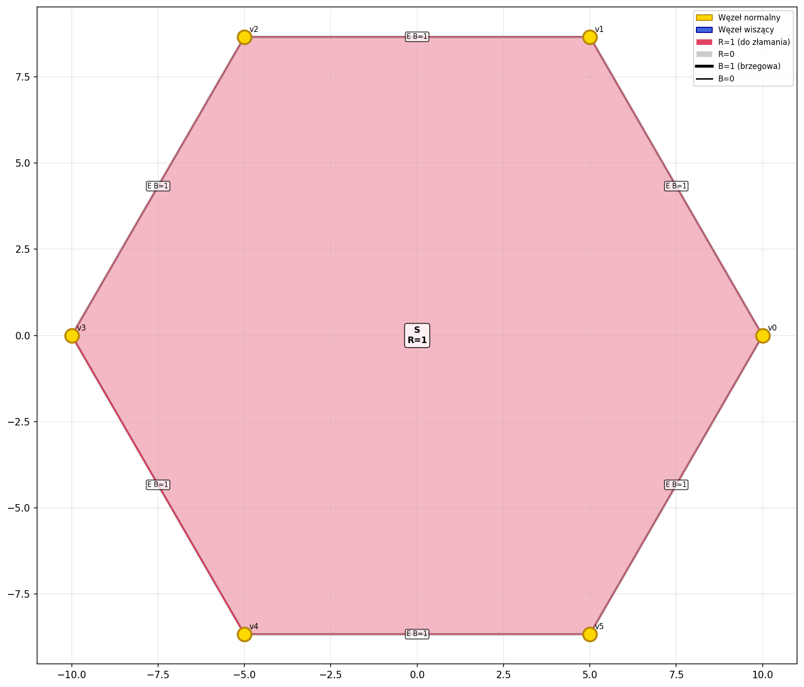
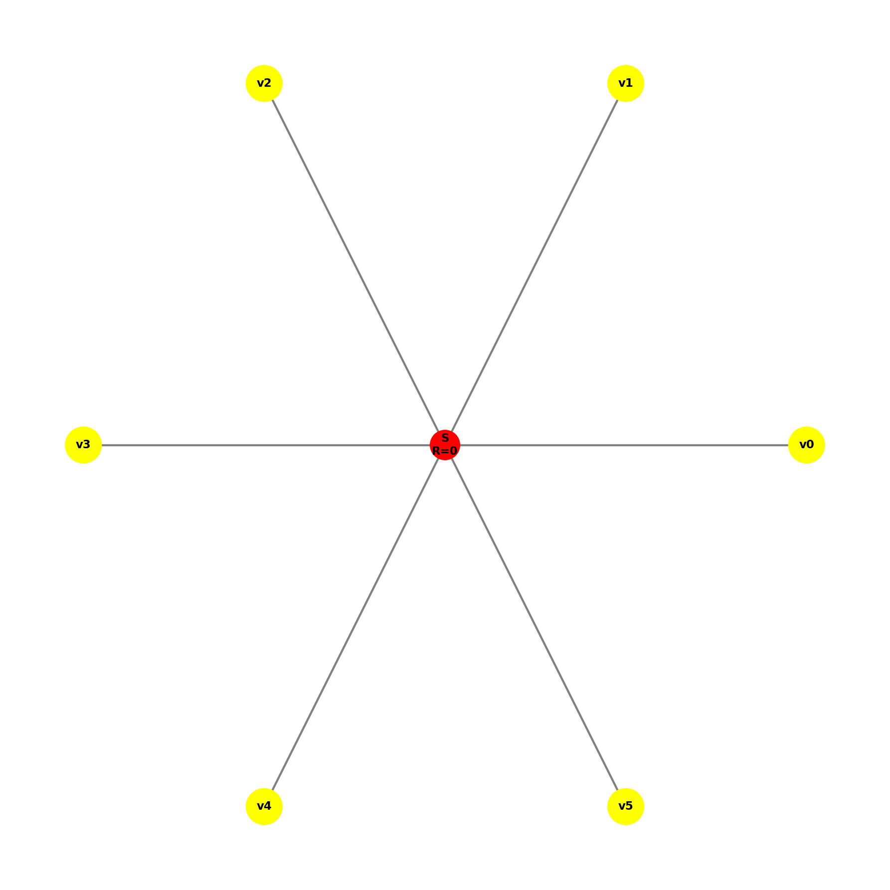
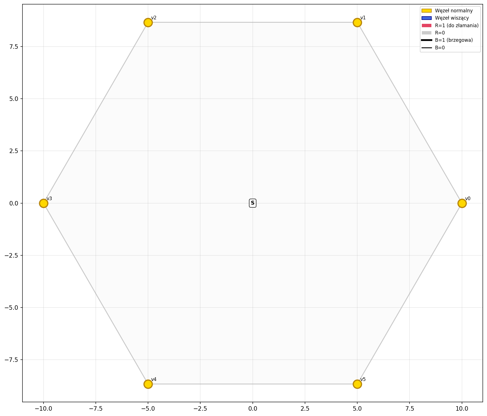
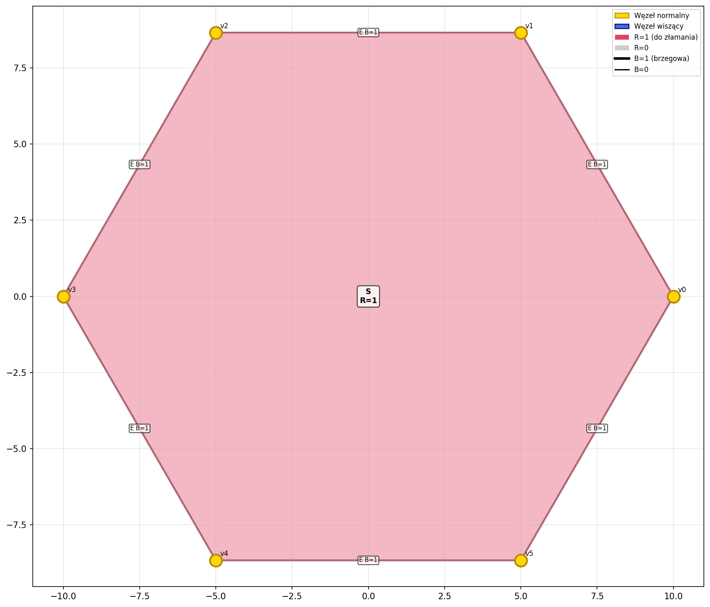
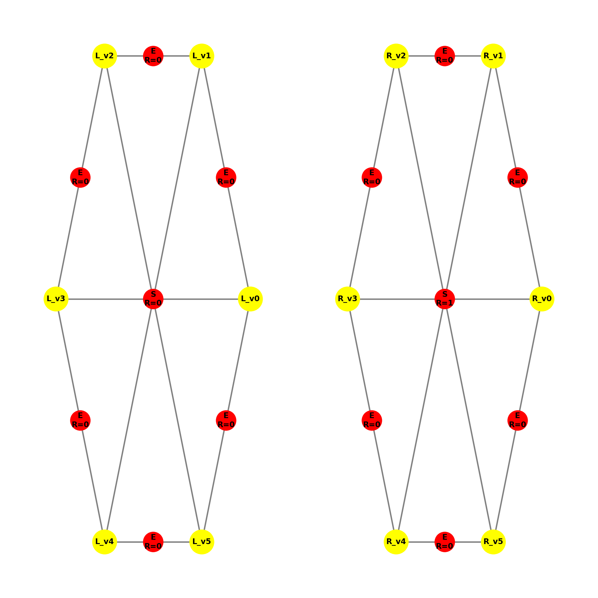
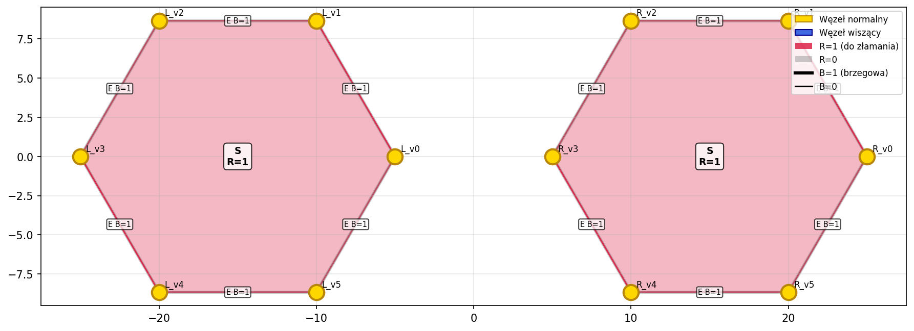
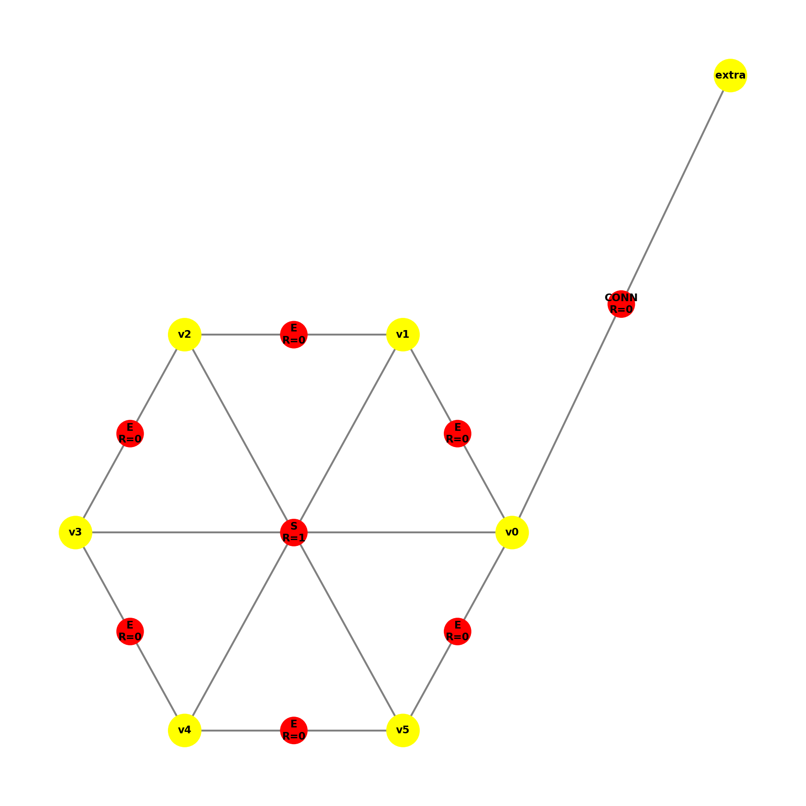
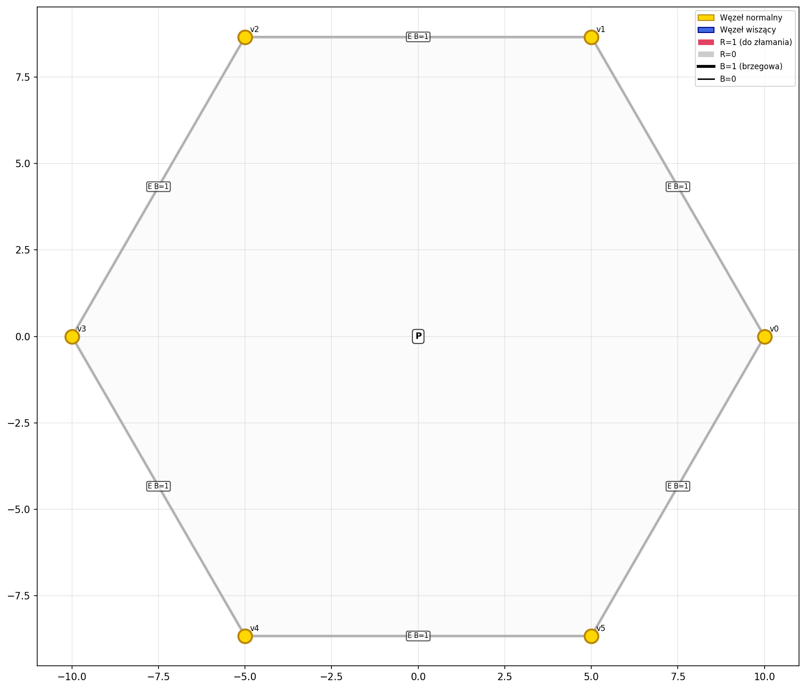
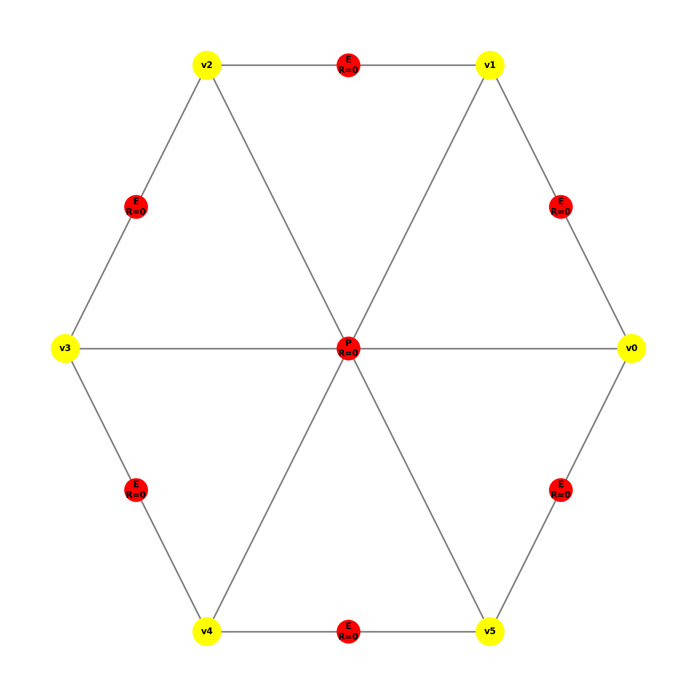

# Dokumentacja Produkcji P9

## Gramatyka Hipergrafów – Metoda PolyDPG

### Opis Produkcji P9

**Produkcja P9** jest operacją inicjującą proces podziału (refinementu) elementu heksagonalnego (sześciokątnego). Służy do oznaczenia elementu, który ma zostać poddany dalszym podziałom.

W przeciwieństwie do produkcji geometrycznych (fizycznie dzielących węzły i krawędzie), P9 zmienia jedynie stan wewnętrzny hiperkrawędzi reprezentującej wnętrze heksagonu. Jest to odpowiednik "zaznaczenia" elementu do przetworzenia przez kolejne produkcje (np. P10).

---

## Transformacja Grafu

### Lewa strona produkcji (LHS)

Produkcja P9 wyszukuje podgraf (wzorzec) o ściśle określonej topologii:
1.  **Hiperkrawędź centralna**: Typu `S` (reprezentująca wnętrze).
2.  **Atrybut R=0**: Oznacza, że element nie jest jeszcze przeznaczony do podziału.
3.  **Liczba wierzchołków**: Dokładnie 6 unikalnych wierzchołków podłączonych do `S`.
4.  **Kontekst topologiczny**: Wierzchołki te muszą być połączone krawędziami brzegowymi typu `E`, tworząc zamknięty cykl (obwód heksagonu).

### Prawa strona produkcji (RHS)

Po zastosowaniu produkcji:
1.  **Topologia**: Nie ulega zmianie (liczba węzłów i krawędzi pozostaje ta sama).
2.  **Atrybuty**: Hiperkrawędź `S` zmienia wartość atrybutu **R na 1**.
3.  **Kontekst**: Pozostałe atrybuty (w tym krawędzi `E`) pozostają bez zmian.

**Schemat działania:**
```text
      (Przed - LHS)                  (Po - RHS)
        v5 --- v0                     v5 --- v0
       /         \                   /         \
     v4     S     v1      ===>     v4     S     v1
      \    R=0   /                  \    R=1   /
       v3 --- v2                     v3 --- v2

---

## Algorytm i Implementacja

Kluczowym elementem implementacji jest weryfikacja nie tylko etykiet, ale i pełnej topologii heksagonu, aby uniknąć aplikacji produkcji na niekompletnych strukturach (np. samym wnętrzu bez brzegów).

### Weryfikacja izomorfizmu (can_apply)

Metoda wykorzystuje funkcję pomocniczą `_check_topology`, która sprawdza:
1.  Czy krawędź ma etykietę `S` i `R=0`.
2.  Czy krawędź łączy dokładnie 6 węzłów.
3.  Czy dla każdej pary sąsiednich węzłów w `S` istnieje w grafie krawędź typu `E`.

Fragment kodu odpowiedzialny za weryfikację:

```python
def _check_topology(self, graph: Graph, s_edge: HyperEdge) -> bool:
    # 1. Sprawdzenie etykiety i atrybutu
    if s_edge.hypertag != "S" or s_edge.R != 0: return False
    
    # 2. Sprawdzenie stopnia (heksagon = 6)
    if len(s_edge.nodes) != 6: return False

    # 3. Sprawdzenie obecności krawędzi E na obwodzie
    nodes = s_edge.nodes
    for i in range(6):
        u = nodes[i]
        v = nodes[(i + 1) % 6]
        # Sprawdź czy istnieje krawędź E między u i v
        if not any(e.hypertag == "E" and set(e.nodes) == {u, v} for e in graph.hyperedges):
            return False
    return True
```

---

## Raport z Testów

Testy weryfikują poprawność działania produkcji w różnych scenariuszach, w tym przypadkach brzegowych i negatywnych. Wszystkie testy przeszły pomyślnie.

### 1. Test poprawności izomorfizmu (test_apply_isomorphic)
**Cel:** Sprawdzenie aplikacji produkcji do kompletnego, poprawnego heksagonu.
* **Wejście:** Heksagon (S, R=0) otoczony krawędziami E.
* **Oczekiwany wynik:** Zmiana atrybutu R na 1 w krawędzi S. Struktura zachowana.
* **Status:** ✅ PASSED

| Przed (LHS) | Po (RHS) |
|:---:|:---:|
|  |  |

---

### 2. Test niekompletnej topologii (test_apply_missing_boundary_edges)
**Cel:** Weryfikacja, czy produkcja odrzuci graf posiadający wnętrze `S`, ale pozbawiony krawędzi obwodowych `E`.
* **Wejście:** 6 węzłów + krawędź S, brak krawędzi E.
* **Oczekiwany wynik:** Produkcja nie zostaje wykonana (`False`).
* **Status:** ✅ PASSED

| Przed | Po |
|:---:|:---:|
|  |  |

---

### 3. Test elementu już oznaczonego (test_apply_R1)
**Cel:** Sprawdzenie, czy produkcja ignoruje elementy, które zostały już przetworzone (mają R=1).
* **Wejście:** Heksagon z S (R=1).
* **Oczekiwany wynik:** Brak zmian.
* **Status:** ✅ PASSED

| Przed | Po |
|:---:|:---:|
|  |  |

---

### 4. Test selektywności (test_two_hexagons_one_ready)
**Cel:** Weryfikacja działania w grafie zawierającym wiele elementów.
* **Wejście:** Graf z dwoma heksagonami: lewy (R=0, gotowy), prawy (R=1, zajęty).
* **Oczekiwany wynik:** Tylko lewy heksagon zmienia R na 1. Prawy pozostaje bez zmian.
* **Status:** ✅ PASSED

| Przed | Po |
|:---:|:---:|
|  |  |

---

### 5. Test zachowania kontekstu (test_apply_on_complex_graph_preserves_context)
**Cel:** Sprawdzenie, czy produkcja nie uszkadza elementów grafu niebiorących udziału w transformacji ("szum", dodatkowe węzły).
* **Wejście:** Heksagon oraz dodatkowy, niepołączony węzeł i krawędź.
* **Oczekiwany wynik:** Heksagon przetworzony, dodatkowe elementy nienaruszone.
* **Status:** ✅ PASSED

| Przed | Po |
|:---:|:---:|
|  |  |

---

### 6. Test błędnej etykiety (test_wrong_hypertag)
**Cel:** Test negatywny dla niepoprawnej etykiety (np. 'P' zamiast 'S').
* **Wejście:** Element geometrycznie poprawny, ale z etykietą 'P'.
* **Oczekiwany wynik:** Produkcja nie zostaje wykonana.
* **Status:** ✅ PASSED

| Przed | Po |
|:---:|:---:|
|  |  |

