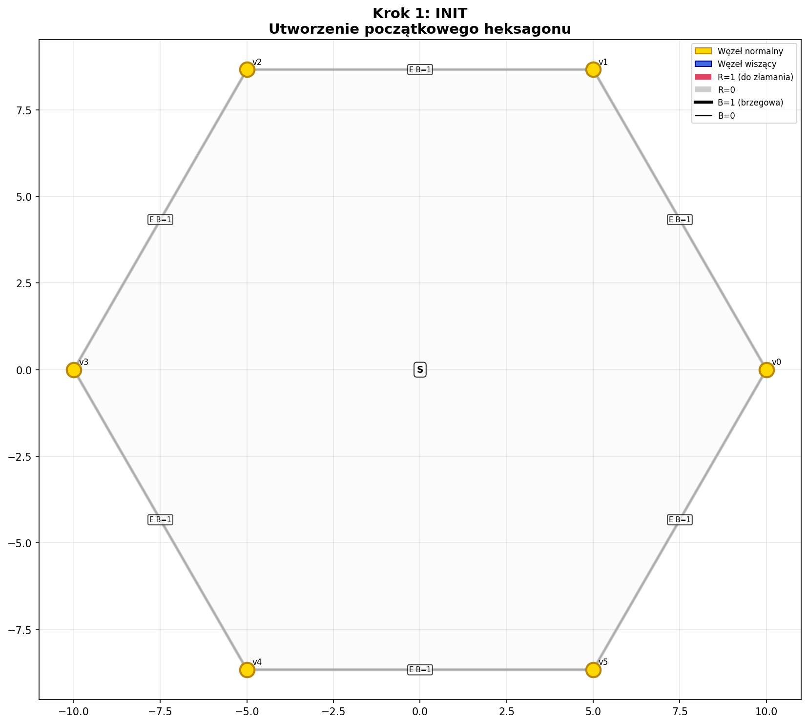
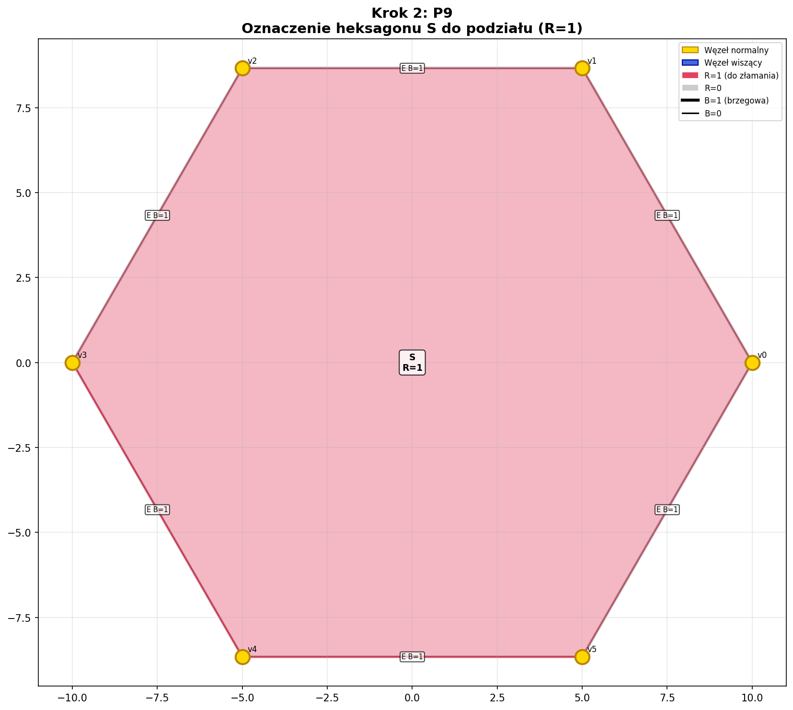
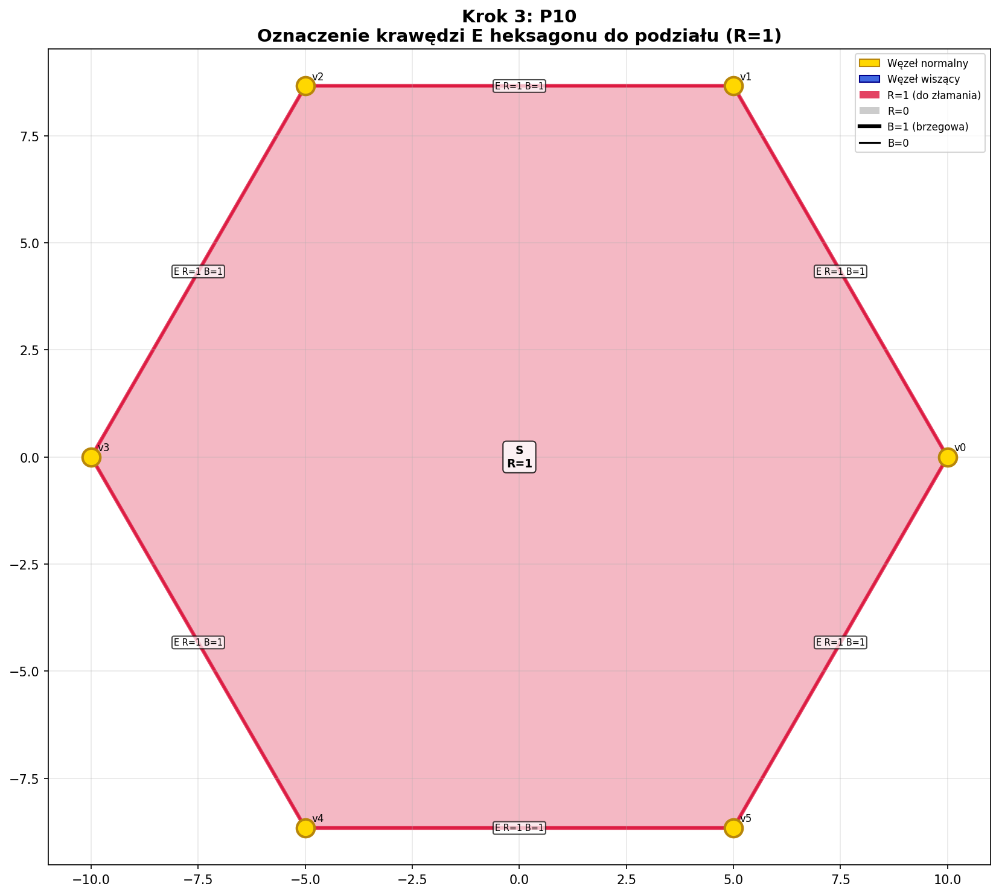
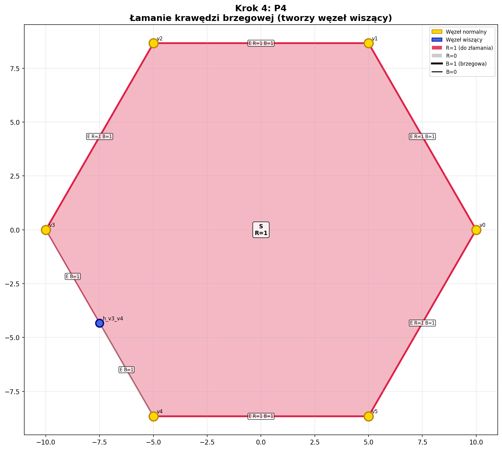
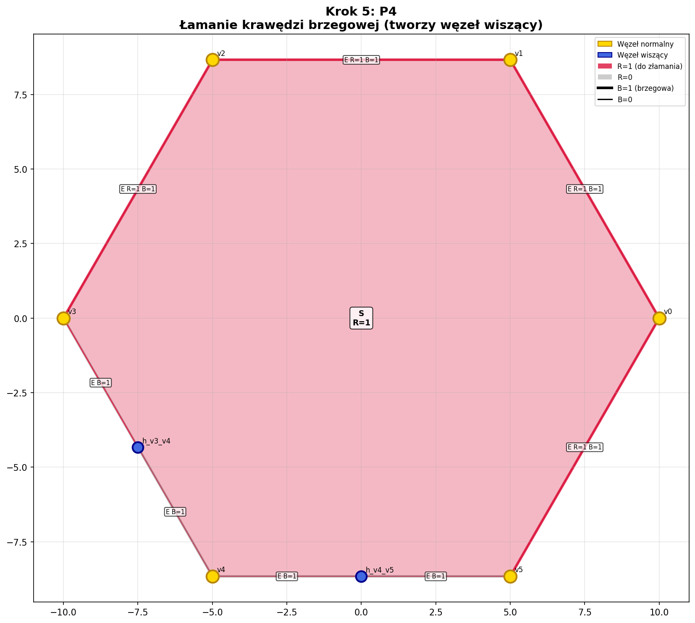
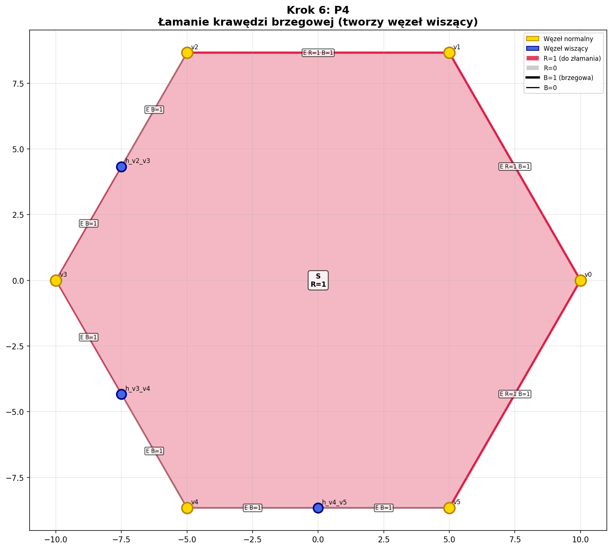
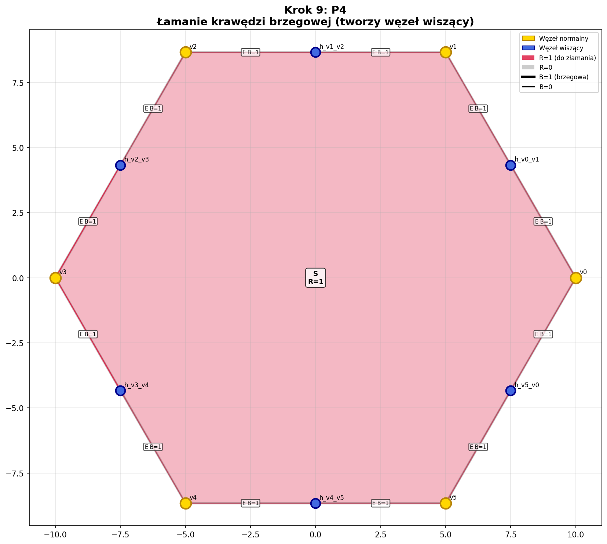

# Wywód dla Grupy 5 - Siatka Heksagonalna

## Sekwencja kroków

| Krok | Produkcja | Opis |
|------|-----------|------|
| 1 | INIT | Utworzenie początkowego heksagonu |
| 2 | P9 | Oznaczenie heksagonu S do podziału (R=1) |
| 3 | P10 | Oznaczenie krawędzi E heksagonu do podziału (R=1) |
| 4 | P4 | Łamanie krawędzi brzegowej (tworzy węzeł wiszący) |
| 5 | P4 | Łamanie krawędzi brzegowej (tworzy węzeł wiszący) |
| 6 | P4 | Łamanie krawędzi brzegowej (tworzy węzeł wiszący) |
| 7 | P4 | Łamanie krawędzi brzegowej (tworzy węzeł wiszący) |
| 8 | P4 | Łamanie krawędzi brzegowej (tworzy węzeł wiszący) |
| 9 | P4 | Łamanie krawędzi brzegowej (tworzy węzeł wiszący) |

## Obrazy

### Krok 1: INIT

### Krok 2: P9

### Krok 3: P10

### Krok 4: P4

### Krok 5: P4

### Krok 6: P4

### Krok 7: P4

### Krok 8: P4

### Krok 9: P4

